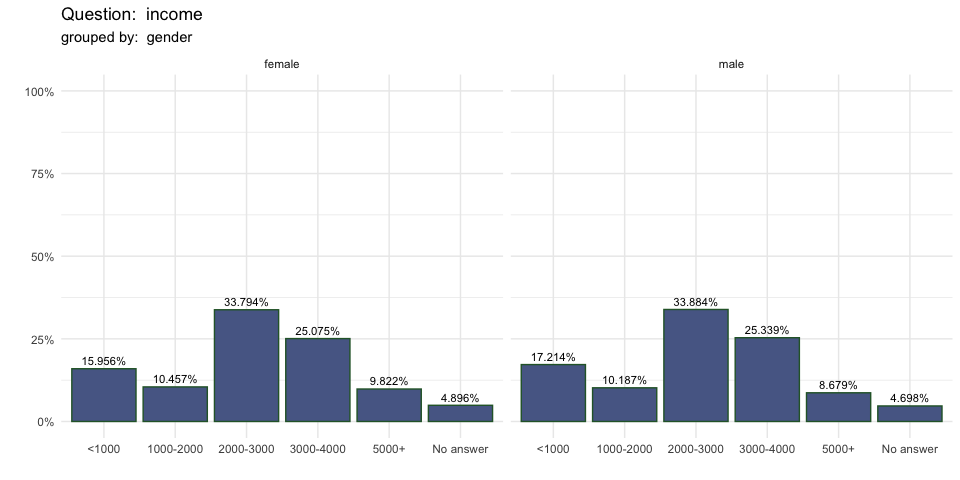

<!-- README.md is generated from README.Rmd. Please edit that file -->

## Surveyexplorer

Visualize and tabulate single-choice, multiple-choice, matrix-style
questions from survey data. Includes ability to group cross-tabulations,
frequency distributions, and plots by categorical variables and to
integrate survey weights. Ideal for quickly uncovering descriptive
patterns in survey data.

## Installation

``` r
# install.packages("devtools"), if not already downloaded
devtools::install_github("liamhaller/surveyexplorer")
```

# Examples

``` r
library(surveyexplorer)
```

The data used in the following examples is from the `berlinbears`
dataset, a fictional survey of bears in Berlin, that is included in the
`surveyexplorer` package.

### Single-choice questions

``` r
#Basic table
single_table(berlinbears, 
             question = income)
```

<div id="ersfjxkfnl" style="padding-left:0px;padding-right:0px;padding-top:10px;padding-bottom:10px;overflow-x:auto;overflow-y:auto;width:auto;height:auto;">
  &#10;  <table class="gt_table" data-quarto-disable-processing="false" data-quarto-bootstrap="false" style="-webkit-font-smoothing: antialiased; -moz-osx-font-smoothing: grayscale; font-family: system-ui, 'Segoe UI', Roboto, Helvetica, Arial, sans-serif, 'Apple Color Emoji', 'Segoe UI Emoji', 'Segoe UI Symbol', 'Noto Color Emoji'; display: table; border-collapse: collapse; line-height: normal; margin-left: auto; margin-right: auto; color: #333333; font-size: 16px; font-weight: normal; font-style: normal; background-color: #FFFFFF; width: auto; border-top-style: solid; border-top-width: 2px; border-top-color: #A8A8A8; border-right-style: none; border-right-width: 2px; border-right-color: #D3D3D3; border-bottom-style: solid; border-bottom-width: 2px; border-bottom-color: #A8A8A8; border-left-style: none; border-left-width: 2px; border-left-color: #D3D3D3;" bgcolor="#FFFFFF">
  <thead style="border-style: none;">
    <tr class="gt_heading" style="border-style: none; background-color: #FFFFFF; text-align: center; border-bottom-color: #FFFFFF; border-left-style: none; border-left-width: 1px; border-left-color: #D3D3D3; border-right-style: none; border-right-width: 1px; border-right-color: #D3D3D3;" bgcolor="#FFFFFF" align="center">
      <td colspan="3" class="gt_heading gt_title gt_font_normal gt_bottom_border" style="border-style: none; color: #333333; font-size: 125%; padding-top: 4px; padding-bottom: 4px; padding-left: 5px; padding-right: 5px; background-color: #FFFFFF; text-align: center; border-left-style: none; border-left-width: 1px; border-left-color: #D3D3D3; border-right-style: none; border-right-width: 1px; border-right-color: #D3D3D3; border-bottom-style: solid; border-bottom-width: 2px; border-bottom-color: #D3D3D3; font-weight: normal;" bgcolor="#FFFFFF" align="center">Question: income</td>
    </tr>
    &#10;    <tr class="gt_col_headings" style="border-style: none; border-top-style: solid; border-top-width: 2px; border-top-color: #D3D3D3; border-bottom-style: solid; border-bottom-width: 2px; border-bottom-color: #D3D3D3; border-left-style: none; border-left-width: 1px; border-left-color: #D3D3D3; border-right-style: none; border-right-width: 1px; border-right-color: #D3D3D3;">
      <th class="gt_col_heading gt_columns_bottom_border gt_left" rowspan="1" colspan="1" scope="col" id style="border-style: none; color: #333333; background-color: #FFFFFF; font-size: 100%; font-weight: normal; text-transform: inherit; border-left-style: none; border-left-width: 1px; border-left-color: #D3D3D3; border-right-style: none; border-right-width: 1px; border-right-color: #D3D3D3; vertical-align: bottom; padding-top: 5px; padding-bottom: 6px; padding-left: 5px; padding-right: 5px; overflow-x: hidden; text-align: left;" bgcolor="#FFFFFF" valign="bottom" align="left"></th>
      <th class="gt_col_heading gt_columns_bottom_border gt_right" rowspan="1" colspan="1" style="border-style: none; color: #333333; background-color: #FFFFFF; font-size: 100%; font-weight: normal; text-transform: inherit; border-left-style: none; border-left-width: 1px; border-left-color: #D3D3D3; border-right-style: none; border-right-width: 1px; border-right-color: #D3D3D3; vertical-align: bottom; padding-top: 5px; padding-bottom: 6px; padding-left: 5px; padding-right: 5px; overflow-x: hidden; font-variant-numeric: tabular-nums; text-align: center;" scope="col" id="n" align="center" bgcolor="#FFFFFF" valign="bottom">n</th>
      <th class="gt_col_heading gt_columns_bottom_border gt_right" rowspan="1" colspan="1" style="border-style: none; color: #333333; background-color: #FFFFFF; font-size: 100%; font-weight: normal; text-transform: inherit; border-left-style: none; border-left-width: 1px; border-left-color: #D3D3D3; border-right-style: none; border-right-width: 1px; border-right-color: #D3D3D3; vertical-align: bottom; padding-top: 5px; padding-bottom: 6px; padding-left: 5px; padding-right: 5px; overflow-x: hidden; font-variant-numeric: tabular-nums; text-align: center;" scope="col" id="freq" align="center" bgcolor="#FFFFFF" valign="bottom">freq</th>
    </tr>
  </thead>
  <tbody class="gt_table_body" style="border-style: none; border-top-style: solid; border-top-width: 2px; border-top-color: #D3D3D3; border-bottom-style: solid; border-bottom-width: 2px; border-bottom-color: #D3D3D3;">
    <tr style="border-style: none;"><th id="stub_1_1" scope="row" class="gt_row gt_center gt_stub" style="border-style: none; padding-top: 8px; padding-bottom: 8px; margin: 10px; border-top-style: solid; border-top-width: 1px; border-top-color: #D3D3D3; border-left-style: none; border-left-width: 1px; border-left-color: #D3D3D3; vertical-align: middle; overflow-x: hidden; color: #333333; background-color: #FFFFFF; font-size: 100%; font-weight: initial; text-transform: inherit; border-right-style: solid; border-right-width: 2px; border-right-color: #D3D3D3; padding-left: 5px; padding-right: 5px; text-align: center;" valign="middle" bgcolor="#FFFFFF" align="center">&lt;1000</th>
<td headers="stub_1_1 n" class="gt_row gt_right" style="border-style: none; padding-top: 8px; padding-bottom: 8px; padding-left: 5px; padding-right: 5px; margin: 10px; border-top-style: solid; border-top-width: 1px; border-top-color: #D3D3D3; border-left-style: none; border-left-width: 1px; border-left-color: #D3D3D3; border-right-style: none; border-right-width: 1px; border-right-color: #D3D3D3; vertical-align: middle; overflow-x: hidden; text-align: right; font-variant-numeric: tabular-nums;" valign="middle" align="right">82</td>
<td headers="stub_1_1 freq" class="gt_row gt_right" style="border-style: none; padding-top: 8px; padding-bottom: 8px; padding-left: 5px; padding-right: 5px; margin: 10px; border-top-style: solid; border-top-width: 1px; border-top-color: #D3D3D3; border-left-style: none; border-left-width: 1px; border-left-color: #D3D3D3; border-right-style: none; border-right-width: 1px; border-right-color: #D3D3D3; vertical-align: middle; overflow-x: hidden; text-align: right; font-variant-numeric: tabular-nums;" valign="middle" align="right">16.40%</td></tr>
    <tr style="border-style: none;"><th id="stub_1_2" scope="row" class="gt_row gt_center gt_stub" style="border-style: none; padding-top: 8px; padding-bottom: 8px; margin: 10px; border-top-style: solid; border-top-width: 1px; border-top-color: #D3D3D3; border-left-style: none; border-left-width: 1px; border-left-color: #D3D3D3; vertical-align: middle; overflow-x: hidden; color: #333333; background-color: #FFFFFF; font-size: 100%; font-weight: initial; text-transform: inherit; border-right-style: solid; border-right-width: 2px; border-right-color: #D3D3D3; padding-left: 5px; padding-right: 5px; text-align: center;" valign="middle" bgcolor="#FFFFFF" align="center">1000-2000</th>
<td headers="stub_1_2 n" class="gt_row gt_right" style="border-style: none; padding-top: 8px; padding-bottom: 8px; padding-left: 5px; padding-right: 5px; margin: 10px; border-top-style: solid; border-top-width: 1px; border-top-color: #D3D3D3; border-left-style: none; border-left-width: 1px; border-left-color: #D3D3D3; border-right-style: none; border-right-width: 1px; border-right-color: #D3D3D3; vertical-align: middle; overflow-x: hidden; text-align: right; font-variant-numeric: tabular-nums;" valign="middle" align="right">50</td>
<td headers="stub_1_2 freq" class="gt_row gt_right" style="border-style: none; padding-top: 8px; padding-bottom: 8px; padding-left: 5px; padding-right: 5px; margin: 10px; border-top-style: solid; border-top-width: 1px; border-top-color: #D3D3D3; border-left-style: none; border-left-width: 1px; border-left-color: #D3D3D3; border-right-style: none; border-right-width: 1px; border-right-color: #D3D3D3; vertical-align: middle; overflow-x: hidden; text-align: right; font-variant-numeric: tabular-nums;" valign="middle" align="right">10.00%</td></tr>
    <tr style="border-style: none;"><th id="stub_1_3" scope="row" class="gt_row gt_center gt_stub" style="border-style: none; padding-top: 8px; padding-bottom: 8px; margin: 10px; border-top-style: solid; border-top-width: 1px; border-top-color: #D3D3D3; border-left-style: none; border-left-width: 1px; border-left-color: #D3D3D3; vertical-align: middle; overflow-x: hidden; color: #333333; background-color: #FFFFFF; font-size: 100%; font-weight: initial; text-transform: inherit; border-right-style: solid; border-right-width: 2px; border-right-color: #D3D3D3; padding-left: 5px; padding-right: 5px; text-align: center;" valign="middle" bgcolor="#FFFFFF" align="center">2000-3000</th>
<td headers="stub_1_3 n" class="gt_row gt_right" style="border-style: none; padding-top: 8px; padding-bottom: 8px; padding-left: 5px; padding-right: 5px; margin: 10px; border-top-style: solid; border-top-width: 1px; border-top-color: #D3D3D3; border-left-style: none; border-left-width: 1px; border-left-color: #D3D3D3; border-right-style: none; border-right-width: 1px; border-right-color: #D3D3D3; vertical-align: middle; overflow-x: hidden; text-align: right; font-variant-numeric: tabular-nums;" valign="middle" align="right">177</td>
<td headers="stub_1_3 freq" class="gt_row gt_right" style="border-style: none; padding-top: 8px; padding-bottom: 8px; padding-left: 5px; padding-right: 5px; margin: 10px; border-top-style: solid; border-top-width: 1px; border-top-color: #D3D3D3; border-left-style: none; border-left-width: 1px; border-left-color: #D3D3D3; border-right-style: none; border-right-width: 1px; border-right-color: #D3D3D3; vertical-align: middle; overflow-x: hidden; text-align: right; font-variant-numeric: tabular-nums;" valign="middle" align="right">35.40%</td></tr>
    <tr style="border-style: none;"><th id="stub_1_4" scope="row" class="gt_row gt_center gt_stub" style="border-style: none; padding-top: 8px; padding-bottom: 8px; margin: 10px; border-top-style: solid; border-top-width: 1px; border-top-color: #D3D3D3; border-left-style: none; border-left-width: 1px; border-left-color: #D3D3D3; vertical-align: middle; overflow-x: hidden; color: #333333; background-color: #FFFFFF; font-size: 100%; font-weight: initial; text-transform: inherit; border-right-style: solid; border-right-width: 2px; border-right-color: #D3D3D3; padding-left: 5px; padding-right: 5px; text-align: center;" valign="middle" bgcolor="#FFFFFF" align="center">3000-4000</th>
<td headers="stub_1_4 n" class="gt_row gt_right" style="border-style: none; padding-top: 8px; padding-bottom: 8px; padding-left: 5px; padding-right: 5px; margin: 10px; border-top-style: solid; border-top-width: 1px; border-top-color: #D3D3D3; border-left-style: none; border-left-width: 1px; border-left-color: #D3D3D3; border-right-style: none; border-right-width: 1px; border-right-color: #D3D3D3; vertical-align: middle; overflow-x: hidden; text-align: right; font-variant-numeric: tabular-nums;" valign="middle" align="right">109</td>
<td headers="stub_1_4 freq" class="gt_row gt_right" style="border-style: none; padding-top: 8px; padding-bottom: 8px; padding-left: 5px; padding-right: 5px; margin: 10px; border-top-style: solid; border-top-width: 1px; border-top-color: #D3D3D3; border-left-style: none; border-left-width: 1px; border-left-color: #D3D3D3; border-right-style: none; border-right-width: 1px; border-right-color: #D3D3D3; vertical-align: middle; overflow-x: hidden; text-align: right; font-variant-numeric: tabular-nums;" valign="middle" align="right">21.80%</td></tr>
    <tr style="border-style: none;"><th id="stub_1_5" scope="row" class="gt_row gt_center gt_stub" style="border-style: none; padding-top: 8px; padding-bottom: 8px; margin: 10px; border-top-style: solid; border-top-width: 1px; border-top-color: #D3D3D3; border-left-style: none; border-left-width: 1px; border-left-color: #D3D3D3; vertical-align: middle; overflow-x: hidden; color: #333333; background-color: #FFFFFF; font-size: 100%; font-weight: initial; text-transform: inherit; border-right-style: solid; border-right-width: 2px; border-right-color: #D3D3D3; padding-left: 5px; padding-right: 5px; text-align: center;" valign="middle" bgcolor="#FFFFFF" align="center">5000+</th>
<td headers="stub_1_5 n" class="gt_row gt_right" style="border-style: none; padding-top: 8px; padding-bottom: 8px; padding-left: 5px; padding-right: 5px; margin: 10px; border-top-style: solid; border-top-width: 1px; border-top-color: #D3D3D3; border-left-style: none; border-left-width: 1px; border-left-color: #D3D3D3; border-right-style: none; border-right-width: 1px; border-right-color: #D3D3D3; vertical-align: middle; overflow-x: hidden; text-align: right; font-variant-numeric: tabular-nums;" valign="middle" align="right">57</td>
<td headers="stub_1_5 freq" class="gt_row gt_right" style="border-style: none; padding-top: 8px; padding-bottom: 8px; padding-left: 5px; padding-right: 5px; margin: 10px; border-top-style: solid; border-top-width: 1px; border-top-color: #D3D3D3; border-left-style: none; border-left-width: 1px; border-left-color: #D3D3D3; border-right-style: none; border-right-width: 1px; border-right-color: #D3D3D3; vertical-align: middle; overflow-x: hidden; text-align: right; font-variant-numeric: tabular-nums;" valign="middle" align="right">11.40%</td></tr>
    <tr style="border-style: none;"><th id="stub_1_6" scope="row" class="gt_row gt_center gt_stub" style="border-style: none; padding-top: 8px; padding-bottom: 8px; margin: 10px; border-top-style: solid; border-top-width: 1px; border-top-color: #D3D3D3; border-left-style: none; border-left-width: 1px; border-left-color: #D3D3D3; vertical-align: middle; overflow-x: hidden; color: #333333; background-color: #FFFFFF; font-size: 100%; font-weight: initial; text-transform: inherit; border-right-style: solid; border-right-width: 2px; border-right-color: #D3D3D3; padding-left: 5px; padding-right: 5px; text-align: center;" valign="middle" bgcolor="#FFFFFF" align="center">No answer</th>
<td headers="stub_1_6 n" class="gt_row gt_right" style="border-style: none; padding-top: 8px; padding-bottom: 8px; padding-left: 5px; padding-right: 5px; margin: 10px; border-top-style: solid; border-top-width: 1px; border-top-color: #D3D3D3; border-left-style: none; border-left-width: 1px; border-left-color: #D3D3D3; border-right-style: none; border-right-width: 1px; border-right-color: #D3D3D3; vertical-align: middle; overflow-x: hidden; text-align: right; font-variant-numeric: tabular-nums;" valign="middle" align="right">22</td>
<td headers="stub_1_6 freq" class="gt_row gt_right" style="border-style: none; padding-top: 8px; padding-bottom: 8px; padding-left: 5px; padding-right: 5px; margin: 10px; border-top-style: solid; border-top-width: 1px; border-top-color: #D3D3D3; border-left-style: none; border-left-width: 1px; border-left-color: #D3D3D3; border-right-style: none; border-right-width: 1px; border-right-color: #D3D3D3; vertical-align: middle; overflow-x: hidden; text-align: right; font-variant-numeric: tabular-nums;" valign="middle" align="right">4.40%</td></tr>
    <tr style="border-style: none;"><th id="stub_1_7" scope="row" class="gt_row gt_center gt_stub" style="border-style: none; padding-top: 8px; padding-bottom: 8px; margin: 10px; border-top-style: solid; border-top-width: 1px; border-top-color: #D3D3D3; border-left-style: none; border-left-width: 1px; border-left-color: #D3D3D3; vertical-align: middle; overflow-x: hidden; color: #333333; background-color: #FFFFFF; font-size: 100%; font-weight: initial; text-transform: inherit; border-right-style: solid; border-right-width: 2px; border-right-color: #D3D3D3; padding-left: 5px; padding-right: 5px; text-align: center;" valign="middle" bgcolor="#FFFFFF" align="center">NA</th>
<td headers="stub_1_7 n" class="gt_row gt_right" style="border-style: none; padding-top: 8px; padding-bottom: 8px; padding-left: 5px; padding-right: 5px; margin: 10px; border-top-style: solid; border-top-width: 1px; border-top-color: #D3D3D3; border-left-style: none; border-left-width: 1px; border-left-color: #D3D3D3; border-right-style: none; border-right-width: 1px; border-right-color: #D3D3D3; vertical-align: middle; overflow-x: hidden; text-align: right; font-variant-numeric: tabular-nums;" valign="middle" align="right">3</td>
<td headers="stub_1_7 freq" class="gt_row gt_right" style="border-style: none; padding-top: 8px; padding-bottom: 8px; padding-left: 5px; padding-right: 5px; margin: 10px; border-top-style: solid; border-top-width: 1px; border-top-color: #D3D3D3; border-left-style: none; border-left-width: 1px; border-left-color: #D3D3D3; border-right-style: none; border-right-width: 1px; border-right-color: #D3D3D3; vertical-align: middle; overflow-x: hidden; text-align: right; font-variant-numeric: tabular-nums;" valign="middle" align="right">0.60%</td></tr>
    <tr style="border-style: none;"><th id="grand_summary_stub_1" scope="row" class="gt_row gt_left gt_stub gt_grand_summary_row gt_first_grand_summary_row gt_last_summary_row" style="border-style: none; margin: 10px; border-left-style: none; border-left-width: 1px; border-left-color: #D3D3D3; vertical-align: middle; overflow-x: hidden; font-size: 100%; font-weight: initial; border-right-style: solid; border-right-width: 2px; border-right-color: #D3D3D3; border-bottom-style: solid; border-bottom-width: 2px; border-bottom-color: #D3D3D3; color: #333333; background-color: #FFFFFF; text-transform: inherit; padding-top: 8px; padding-bottom: 8px; padding-left: 5px; padding-right: 5px; border-top-style: double; border-top-width: 6px; border-top-color: #D3D3D3; text-align: left;" valign="middle" bgcolor="#FFFFFF" align="left"><strong>Column Total</strong></th>
<td headers="grand_summary_stub_1 n" class="gt_row gt_right gt_grand_summary_row gt_first_grand_summary_row gt_last_summary_row" style="border-style: none; margin: 10px; border-left-style: none; border-left-width: 1px; border-left-color: #D3D3D3; border-right-style: none; border-right-width: 1px; border-right-color: #D3D3D3; vertical-align: middle; overflow-x: hidden; border-bottom-style: solid; border-bottom-width: 2px; border-bottom-color: #D3D3D3; color: #333333; background-color: #FFFFFF; text-transform: inherit; padding-top: 8px; padding-bottom: 8px; padding-left: 5px; padding-right: 5px; border-top-style: double; border-top-width: 6px; border-top-color: #D3D3D3; text-align: right; font-variant-numeric: tabular-nums;" valign="middle" bgcolor="#FFFFFF" align="right">500</td>
<td headers="grand_summary_stub_1 freq" class="gt_row gt_right gt_grand_summary_row gt_first_grand_summary_row gt_last_summary_row" style="border-style: none; margin: 10px; border-left-style: none; border-left-width: 1px; border-left-color: #D3D3D3; border-right-style: none; border-right-width: 1px; border-right-color: #D3D3D3; vertical-align: middle; overflow-x: hidden; border-bottom-style: solid; border-bottom-width: 2px; border-bottom-color: #D3D3D3; color: #333333; background-color: #FFFFFF; text-transform: inherit; padding-top: 8px; padding-bottom: 8px; padding-left: 5px; padding-right: 5px; border-top-style: double; border-top-width: 6px; border-top-color: #D3D3D3; text-align: right; font-variant-numeric: tabular-nums;" valign="middle" bgcolor="#FFFFFF" align="right">1</td></tr>
  </tbody>
  &#10;  
</table>
</div>

Use `group_by =` to partition the question into several groups

``` r
single_table(berlinbears,
             question = income,
             group_by = gender)
```

<div id="psgidwiyjl" style="padding-left:0px;padding-right:0px;padding-top:10px;padding-bottom:10px;overflow-x:auto;overflow-y:auto;width:auto;height:auto;">
<style>#psgidwiyjl table {
  font-family: system-ui, 'Segoe UI', Roboto, Helvetica, Arial, sans-serif, 'Apple Color Emoji', 'Segoe UI Emoji', 'Segoe UI Symbol', 'Noto Color Emoji';
  -webkit-font-smoothing: antialiased;
  -moz-osx-font-smoothing: grayscale;
}
&#10;#psgidwiyjl thead, #psgidwiyjl tbody, #psgidwiyjl tfoot, #psgidwiyjl tr, #psgidwiyjl td, #psgidwiyjl th {
  border-style: none;
}
&#10;#psgidwiyjl p {
  margin: 0;
  padding: 0;
}
&#10;#psgidwiyjl .gt_table {
  display: table;
  border-collapse: collapse;
  line-height: normal;
  margin-left: auto;
  margin-right: auto;
  color: #333333;
  font-size: 16px;
  font-weight: normal;
  font-style: normal;
  background-color: #FFFFFF;
  width: auto;
  border-top-style: solid;
  border-top-width: 2px;
  border-top-color: #A8A8A8;
  border-right-style: none;
  border-right-width: 2px;
  border-right-color: #D3D3D3;
  border-bottom-style: solid;
  border-bottom-width: 2px;
  border-bottom-color: #A8A8A8;
  border-left-style: none;
  border-left-width: 2px;
  border-left-color: #D3D3D3;
}
&#10;#psgidwiyjl .gt_caption {
  padding-top: 4px;
  padding-bottom: 4px;
}
&#10;#psgidwiyjl .gt_title {
  color: #333333;
  font-size: 125%;
  font-weight: initial;
  padding-top: 4px;
  padding-bottom: 4px;
  padding-left: 5px;
  padding-right: 5px;
  border-bottom-color: #FFFFFF;
  border-bottom-width: 0;
}
&#10;#psgidwiyjl .gt_subtitle {
  color: #333333;
  font-size: 85%;
  font-weight: initial;
  padding-top: 3px;
  padding-bottom: 5px;
  padding-left: 5px;
  padding-right: 5px;
  border-top-color: #FFFFFF;
  border-top-width: 0;
}
&#10;#psgidwiyjl .gt_heading {
  background-color: #FFFFFF;
  text-align: center;
  border-bottom-color: #FFFFFF;
  border-left-style: none;
  border-left-width: 1px;
  border-left-color: #D3D3D3;
  border-right-style: none;
  border-right-width: 1px;
  border-right-color: #D3D3D3;
}
&#10;#psgidwiyjl .gt_bottom_border {
  border-bottom-style: solid;
  border-bottom-width: 2px;
  border-bottom-color: #D3D3D3;
}
&#10;#psgidwiyjl .gt_col_headings {
  border-top-style: solid;
  border-top-width: 2px;
  border-top-color: #D3D3D3;
  border-bottom-style: solid;
  border-bottom-width: 2px;
  border-bottom-color: #D3D3D3;
  border-left-style: none;
  border-left-width: 1px;
  border-left-color: #D3D3D3;
  border-right-style: none;
  border-right-width: 1px;
  border-right-color: #D3D3D3;
}
&#10;#psgidwiyjl .gt_col_heading {
  color: #333333;
  background-color: #FFFFFF;
  font-size: 100%;
  font-weight: normal;
  text-transform: inherit;
  border-left-style: none;
  border-left-width: 1px;
  border-left-color: #D3D3D3;
  border-right-style: none;
  border-right-width: 1px;
  border-right-color: #D3D3D3;
  vertical-align: bottom;
  padding-top: 5px;
  padding-bottom: 6px;
  padding-left: 5px;
  padding-right: 5px;
  overflow-x: hidden;
}
&#10;#psgidwiyjl .gt_column_spanner_outer {
  color: #333333;
  background-color: #FFFFFF;
  font-size: 100%;
  font-weight: normal;
  text-transform: inherit;
  padding-top: 0;
  padding-bottom: 0;
  padding-left: 4px;
  padding-right: 4px;
}
&#10;#psgidwiyjl .gt_column_spanner_outer:first-child {
  padding-left: 0;
}
&#10;#psgidwiyjl .gt_column_spanner_outer:last-child {
  padding-right: 0;
}
&#10;#psgidwiyjl .gt_column_spanner {
  border-bottom-style: solid;
  border-bottom-width: 2px;
  border-bottom-color: #D3D3D3;
  vertical-align: bottom;
  padding-top: 5px;
  padding-bottom: 5px;
  overflow-x: hidden;
  display: inline-block;
  width: 100%;
}
&#10;#psgidwiyjl .gt_spanner_row {
  border-bottom-style: hidden;
}
&#10;#psgidwiyjl .gt_group_heading {
  padding-top: 8px;
  padding-bottom: 8px;
  padding-left: 5px;
  padding-right: 5px;
  color: #333333;
  background-color: #FFFFFF;
  font-size: 100%;
  font-weight: initial;
  text-transform: inherit;
  border-top-style: solid;
  border-top-width: 2px;
  border-top-color: #D3D3D3;
  border-bottom-style: solid;
  border-bottom-width: 2px;
  border-bottom-color: #D3D3D3;
  border-left-style: none;
  border-left-width: 1px;
  border-left-color: #D3D3D3;
  border-right-style: none;
  border-right-width: 1px;
  border-right-color: #D3D3D3;
  vertical-align: middle;
  text-align: left;
}
&#10;#psgidwiyjl .gt_empty_group_heading {
  padding: 0.5px;
  color: #333333;
  background-color: #FFFFFF;
  font-size: 100%;
  font-weight: initial;
  border-top-style: solid;
  border-top-width: 2px;
  border-top-color: #D3D3D3;
  border-bottom-style: solid;
  border-bottom-width: 2px;
  border-bottom-color: #D3D3D3;
  vertical-align: middle;
}
&#10;#psgidwiyjl .gt_from_md > :first-child {
  margin-top: 0;
}
&#10;#psgidwiyjl .gt_from_md > :last-child {
  margin-bottom: 0;
}
&#10;#psgidwiyjl .gt_row {
  padding-top: 8px;
  padding-bottom: 8px;
  padding-left: 5px;
  padding-right: 5px;
  margin: 10px;
  border-top-style: solid;
  border-top-width: 1px;
  border-top-color: #D3D3D3;
  border-left-style: none;
  border-left-width: 1px;
  border-left-color: #D3D3D3;
  border-right-style: none;
  border-right-width: 1px;
  border-right-color: #D3D3D3;
  vertical-align: middle;
  overflow-x: hidden;
}
&#10;#psgidwiyjl .gt_stub {
  color: #333333;
  background-color: #FFFFFF;
  font-size: 100%;
  font-weight: initial;
  text-transform: inherit;
  border-right-style: solid;
  border-right-width: 2px;
  border-right-color: #D3D3D3;
  padding-left: 5px;
  padding-right: 5px;
}
&#10;#psgidwiyjl .gt_stub_row_group {
  color: #333333;
  background-color: #FFFFFF;
  font-size: 100%;
  font-weight: initial;
  text-transform: inherit;
  border-right-style: solid;
  border-right-width: 2px;
  border-right-color: #D3D3D3;
  padding-left: 5px;
  padding-right: 5px;
  vertical-align: top;
}
&#10;#psgidwiyjl .gt_row_group_first td {
  border-top-width: 2px;
}
&#10;#psgidwiyjl .gt_row_group_first th {
  border-top-width: 2px;
}
&#10;#psgidwiyjl .gt_summary_row {
  color: #333333;
  background-color: #FFFFFF;
  text-transform: inherit;
  padding-top: 8px;
  padding-bottom: 8px;
  padding-left: 5px;
  padding-right: 5px;
}
&#10;#psgidwiyjl .gt_first_summary_row {
  border-top-style: solid;
  border-top-color: #D3D3D3;
}
&#10;#psgidwiyjl .gt_first_summary_row.thick {
  border-top-width: 2px;
}
&#10;#psgidwiyjl .gt_last_summary_row {
  padding-top: 8px;
  padding-bottom: 8px;
  padding-left: 5px;
  padding-right: 5px;
  border-bottom-style: solid;
  border-bottom-width: 2px;
  border-bottom-color: #D3D3D3;
}
&#10;#psgidwiyjl .gt_grand_summary_row {
  color: #333333;
  background-color: #FFFFFF;
  text-transform: inherit;
  padding-top: 8px;
  padding-bottom: 8px;
  padding-left: 5px;
  padding-right: 5px;
}
&#10;#psgidwiyjl .gt_first_grand_summary_row {
  padding-top: 8px;
  padding-bottom: 8px;
  padding-left: 5px;
  padding-right: 5px;
  border-top-style: double;
  border-top-width: 6px;
  border-top-color: #D3D3D3;
}
&#10;#psgidwiyjl .gt_last_grand_summary_row_top {
  padding-top: 8px;
  padding-bottom: 8px;
  padding-left: 5px;
  padding-right: 5px;
  border-bottom-style: double;
  border-bottom-width: 6px;
  border-bottom-color: #D3D3D3;
}
&#10;#psgidwiyjl .gt_striped {
  background-color: rgba(128, 128, 128, 0.05);
}
&#10;#psgidwiyjl .gt_table_body {
  border-top-style: solid;
  border-top-width: 2px;
  border-top-color: #D3D3D3;
  border-bottom-style: solid;
  border-bottom-width: 2px;
  border-bottom-color: #D3D3D3;
}
&#10;#psgidwiyjl .gt_footnotes {
  color: #333333;
  background-color: #FFFFFF;
  border-bottom-style: none;
  border-bottom-width: 2px;
  border-bottom-color: #D3D3D3;
  border-left-style: none;
  border-left-width: 2px;
  border-left-color: #D3D3D3;
  border-right-style: none;
  border-right-width: 2px;
  border-right-color: #D3D3D3;
}
&#10;#psgidwiyjl .gt_footnote {
  margin: 0px;
  font-size: 90%;
  padding-top: 4px;
  padding-bottom: 4px;
  padding-left: 5px;
  padding-right: 5px;
}
&#10;#psgidwiyjl .gt_sourcenotes {
  color: #333333;
  background-color: #FFFFFF;
  border-bottom-style: none;
  border-bottom-width: 2px;
  border-bottom-color: #D3D3D3;
  border-left-style: none;
  border-left-width: 2px;
  border-left-color: #D3D3D3;
  border-right-style: none;
  border-right-width: 2px;
  border-right-color: #D3D3D3;
}
&#10;#psgidwiyjl .gt_sourcenote {
  font-size: 90%;
  padding-top: 4px;
  padding-bottom: 4px;
  padding-left: 5px;
  padding-right: 5px;
}
&#10;#psgidwiyjl .gt_left {
  text-align: left;
}
&#10;#psgidwiyjl .gt_center {
  text-align: center;
}
&#10;#psgidwiyjl .gt_right {
  text-align: right;
  font-variant-numeric: tabular-nums;
}
&#10;#psgidwiyjl .gt_font_normal {
  font-weight: normal;
}
&#10;#psgidwiyjl .gt_font_bold {
  font-weight: bold;
}
&#10;#psgidwiyjl .gt_font_italic {
  font-style: italic;
}
&#10;#psgidwiyjl .gt_super {
  font-size: 65%;
}
&#10;#psgidwiyjl .gt_footnote_marks {
  font-size: 75%;
  vertical-align: 0.4em;
  position: initial;
}
&#10;#psgidwiyjl .gt_asterisk {
  font-size: 100%;
  vertical-align: 0;
}
&#10;#psgidwiyjl .gt_indent_1 {
  text-indent: 5px;
}
&#10;#psgidwiyjl .gt_indent_2 {
  text-indent: 10px;
}
&#10;#psgidwiyjl .gt_indent_3 {
  text-indent: 15px;
}
&#10;#psgidwiyjl .gt_indent_4 {
  text-indent: 20px;
}
&#10;#psgidwiyjl .gt_indent_5 {
  text-indent: 25px;
}
</style>
<table class="gt_table" data-quarto-disable-processing="false" data-quarto-bootstrap="false">
  <thead>
    <tr class="gt_heading">
      <td colspan="9" class="gt_heading gt_title gt_font_normal" style>Question: income</td>
    </tr>
    <tr class="gt_heading">
      <td colspan="9" class="gt_heading gt_subtitle gt_font_normal gt_bottom_border" style>grouped by: gender</td>
    </tr>
    <tr class="gt_col_headings gt_spanner_row">
      <th class="gt_col_heading gt_columns_bottom_border gt_left" rowspan="2" colspan="1" scope="col" id=""></th>
      <th class="gt_center gt_columns_top_border gt_column_spanner_outer" rowspan="1" colspan="2" scope="colgroup" id="female">
        <span class="gt_column_spanner">female</span>
      </th>
      <th class="gt_center gt_columns_top_border gt_column_spanner_outer" rowspan="1" colspan="2" scope="colgroup" id="male">
        <span class="gt_column_spanner">male</span>
      </th>
      <th class="gt_center gt_columns_top_border gt_column_spanner_outer" rowspan="1" colspan="2" scope="colgroup" id="NA">
        <span class="gt_column_spanner">NA</span>
      </th>
      <th class="gt_center gt_columns_top_border gt_column_spanner_outer" rowspan="1" colspan="2" scope="colgroup" id="&lt;strong&gt;Rowwise Total&lt;/strong&gt;">
        <span class="gt_column_spanner"><strong>Rowwise Total</strong></span>
      </th>
    </tr>
    <tr class="gt_col_headings">
      <th class="gt_col_heading gt_columns_bottom_border gt_right" rowspan="1" colspan="1" style="text-align: center;" scope="col" id="Frequency">Frequency</th>
      <th class="gt_col_heading gt_columns_bottom_border gt_right" rowspan="1" colspan="1" style="text-align: center;" scope="col" id="Count">Count</th>
      <th class="gt_col_heading gt_columns_bottom_border gt_right" rowspan="1" colspan="1" style="text-align: center;" scope="col" id="Frequency">Frequency</th>
      <th class="gt_col_heading gt_columns_bottom_border gt_right" rowspan="1" colspan="1" style="text-align: center;" scope="col" id="Count">Count</th>
      <th class="gt_col_heading gt_columns_bottom_border gt_right" rowspan="1" colspan="1" style="text-align: center;" scope="col" id="Frequency">Frequency</th>
      <th class="gt_col_heading gt_columns_bottom_border gt_right" rowspan="1" colspan="1" style="text-align: center;" scope="col" id="Count">Count</th>
      <th class="gt_col_heading gt_columns_bottom_border gt_right" rowspan="1" colspan="1" style="text-align: center;" scope="col" id="Frequency">Frequency</th>
      <th class="gt_col_heading gt_columns_bottom_border gt_right" rowspan="1" colspan="1" style="text-align: center;" scope="col" id="Count">Count</th>
    </tr>
  </thead>
  <tbody class="gt_table_body">
    <tr><th id="stub_1_1" scope="row" class="gt_row gt_left gt_stub">&lt;1000</th>
<td headers="stub_1_1 female_freq" class="gt_row gt_right">16.74%</td>
<td headers="stub_1_1 female_n" class="gt_row gt_right">39</td>
<td headers="stub_1_1 male_freq" class="gt_row gt_right">15.73%</td>
<td headers="stub_1_1 male_n" class="gt_row gt_right">39</td>
<td headers="stub_1_1 NA_freq" class="gt_row gt_right">21.05%</td>
<td headers="stub_1_1 NA_n" class="gt_row gt_right">4</td>
<td headers="stub_1_1 zztotal_freq" class="gt_row gt_right" style="background-color: #D3D3D3;">16.40%</td>
<td headers="stub_1_1 zztotal_n" class="gt_row gt_right" style="background-color: #D3D3D3;">82</td></tr>
    <tr><th id="stub_1_2" scope="row" class="gt_row gt_left gt_stub">1000-2000</th>
<td headers="stub_1_2 female_freq" class="gt_row gt_right">9.87%</td>
<td headers="stub_1_2 female_n" class="gt_row gt_right">23</td>
<td headers="stub_1_2 male_freq" class="gt_row gt_right">9.68%</td>
<td headers="stub_1_2 male_n" class="gt_row gt_right">24</td>
<td headers="stub_1_2 NA_freq" class="gt_row gt_right">15.79%</td>
<td headers="stub_1_2 NA_n" class="gt_row gt_right">3</td>
<td headers="stub_1_2 zztotal_freq" class="gt_row gt_right" style="background-color: #D3D3D3;">10.00%</td>
<td headers="stub_1_2 zztotal_n" class="gt_row gt_right" style="background-color: #D3D3D3;">50</td></tr>
    <tr><th id="stub_1_3" scope="row" class="gt_row gt_left gt_stub">2000-3000</th>
<td headers="stub_1_3 female_freq" class="gt_row gt_right">35.62%</td>
<td headers="stub_1_3 female_n" class="gt_row gt_right">83</td>
<td headers="stub_1_3 male_freq" class="gt_row gt_right">35.89%</td>
<td headers="stub_1_3 male_n" class="gt_row gt_right">89</td>
<td headers="stub_1_3 NA_freq" class="gt_row gt_right">26.32%</td>
<td headers="stub_1_3 NA_n" class="gt_row gt_right">5</td>
<td headers="stub_1_3 zztotal_freq" class="gt_row gt_right" style="background-color: #D3D3D3;">35.40%</td>
<td headers="stub_1_3 zztotal_n" class="gt_row gt_right" style="background-color: #D3D3D3;">177</td></tr>
    <tr><th id="stub_1_4" scope="row" class="gt_row gt_left gt_stub">3000-4000</th>
<td headers="stub_1_4 female_freq" class="gt_row gt_right">21.89%</td>
<td headers="stub_1_4 female_n" class="gt_row gt_right">51</td>
<td headers="stub_1_4 male_freq" class="gt_row gt_right">22.18%</td>
<td headers="stub_1_4 male_n" class="gt_row gt_right">55</td>
<td headers="stub_1_4 NA_freq" class="gt_row gt_right">15.79%</td>
<td headers="stub_1_4 NA_n" class="gt_row gt_right">3</td>
<td headers="stub_1_4 zztotal_freq" class="gt_row gt_right" style="background-color: #D3D3D3;">21.80%</td>
<td headers="stub_1_4 zztotal_n" class="gt_row gt_right" style="background-color: #D3D3D3;">109</td></tr>
    <tr><th id="stub_1_5" scope="row" class="gt_row gt_left gt_stub">5000+</th>
<td headers="stub_1_5 female_freq" class="gt_row gt_right">11.59%</td>
<td headers="stub_1_5 female_n" class="gt_row gt_right">27</td>
<td headers="stub_1_5 male_freq" class="gt_row gt_right">10.89%</td>
<td headers="stub_1_5 male_n" class="gt_row gt_right">27</td>
<td headers="stub_1_5 NA_freq" class="gt_row gt_right">15.79%</td>
<td headers="stub_1_5 NA_n" class="gt_row gt_right">3</td>
<td headers="stub_1_5 zztotal_freq" class="gt_row gt_right" style="background-color: #D3D3D3;">11.40%</td>
<td headers="stub_1_5 zztotal_n" class="gt_row gt_right" style="background-color: #D3D3D3;">57</td></tr>
    <tr><th id="stub_1_6" scope="row" class="gt_row gt_left gt_stub">No answer</th>
<td headers="stub_1_6 female_freq" class="gt_row gt_right">3.86%</td>
<td headers="stub_1_6 female_n" class="gt_row gt_right">9</td>
<td headers="stub_1_6 male_freq" class="gt_row gt_right">4.84%</td>
<td headers="stub_1_6 male_n" class="gt_row gt_right">12</td>
<td headers="stub_1_6 NA_freq" class="gt_row gt_right">5.26%</td>
<td headers="stub_1_6 NA_n" class="gt_row gt_right">1</td>
<td headers="stub_1_6 zztotal_freq" class="gt_row gt_right" style="background-color: #D3D3D3;">4.40%</td>
<td headers="stub_1_6 zztotal_n" class="gt_row gt_right" style="background-color: #D3D3D3;">22</td></tr>
    <tr><th id="stub_1_7" scope="row" class="gt_row gt_left gt_stub">NA</th>
<td headers="stub_1_7 female_freq" class="gt_row gt_right">0.43%</td>
<td headers="stub_1_7 female_n" class="gt_row gt_right">1</td>
<td headers="stub_1_7 male_freq" class="gt_row gt_right">0.81%</td>
<td headers="stub_1_7 male_n" class="gt_row gt_right">2</td>
<td headers="stub_1_7 NA_freq" class="gt_row gt_right">0.00%</td>
<td headers="stub_1_7 NA_n" class="gt_row gt_right">0</td>
<td headers="stub_1_7 zztotal_freq" class="gt_row gt_right" style="background-color: #D3D3D3;">0.60%</td>
<td headers="stub_1_7 zztotal_n" class="gt_row gt_right" style="background-color: #D3D3D3;">3</td></tr>
    <tr><th id="stub_1_8" scope="row" class="gt_row gt_left gt_stub" style="font-weight: bold;">Columnwise Total</th>
<td headers="stub_1_8 female_freq" class="gt_row gt_right" style="background-color: #D3D3D3;">46.60%</td>
<td headers="stub_1_8 female_n" class="gt_row gt_right" style="background-color: #D3D3D3;">233</td>
<td headers="stub_1_8 male_freq" class="gt_row gt_right" style="background-color: #D3D3D3;">49.60%</td>
<td headers="stub_1_8 male_n" class="gt_row gt_right" style="background-color: #D3D3D3;">248</td>
<td headers="stub_1_8 NA_freq" class="gt_row gt_right" style="background-color: #D3D3D3;">3.80%</td>
<td headers="stub_1_8 NA_n" class="gt_row gt_right" style="background-color: #D3D3D3;">19</td>
<td headers="stub_1_8 zztotal_freq" class="gt_row gt_right" style="background-color: #D3D3D3;">100.00%</td>
<td headers="stub_1_8 zztotal_n" class="gt_row gt_right" style="background-color: #D3D3D3;">500</td></tr>
  </tbody>
  &#10;  
</table>
</div>

Ignore unwanted subgroups with `subgroups_to_exclude`

``` r
single_table(berlinbears,
             question = income, 
             group_by = gender, 
             subgroups_to_exclude = NA) |> gt::as_raw_html()
```

<div id="oyzptofmef" style="padding-left:0px;padding-right:0px;padding-top:10px;padding-bottom:10px;overflow-x:auto;overflow-y:auto;width:auto;height:auto;">
  &#10;  <table class="gt_table" data-quarto-disable-processing="false" data-quarto-bootstrap="false" style="-webkit-font-smoothing: antialiased; -moz-osx-font-smoothing: grayscale; font-family: system-ui, 'Segoe UI', Roboto, Helvetica, Arial, sans-serif, 'Apple Color Emoji', 'Segoe UI Emoji', 'Segoe UI Symbol', 'Noto Color Emoji'; display: table; border-collapse: collapse; line-height: normal; margin-left: auto; margin-right: auto; color: #333333; font-size: 16px; font-weight: normal; font-style: normal; background-color: #FFFFFF; width: auto; border-top-style: solid; border-top-width: 2px; border-top-color: #A8A8A8; border-right-style: none; border-right-width: 2px; border-right-color: #D3D3D3; border-bottom-style: solid; border-bottom-width: 2px; border-bottom-color: #A8A8A8; border-left-style: none; border-left-width: 2px; border-left-color: #D3D3D3;" bgcolor="#FFFFFF">
  <thead style="border-style: none;">
    <tr class="gt_heading" style="border-style: none; background-color: #FFFFFF; text-align: center; border-bottom-color: #FFFFFF; border-left-style: none; border-left-width: 1px; border-left-color: #D3D3D3; border-right-style: none; border-right-width: 1px; border-right-color: #D3D3D3;" bgcolor="#FFFFFF" align="center">
      <td colspan="7" class="gt_heading gt_title gt_font_normal" style="border-style: none; color: #333333; font-size: 125%; padding-top: 4px; padding-bottom: 4px; padding-left: 5px; padding-right: 5px; border-bottom-width: 0; background-color: #FFFFFF; text-align: center; border-bottom-color: #FFFFFF; border-left-style: none; border-left-width: 1px; border-left-color: #D3D3D3; border-right-style: none; border-right-width: 1px; border-right-color: #D3D3D3; font-weight: normal;" bgcolor="#FFFFFF" align="center">Question: income</td>
    </tr>
    <tr class="gt_heading" style="border-style: none; background-color: #FFFFFF; text-align: center; border-bottom-color: #FFFFFF; border-left-style: none; border-left-width: 1px; border-left-color: #D3D3D3; border-right-style: none; border-right-width: 1px; border-right-color: #D3D3D3;" bgcolor="#FFFFFF" align="center">
      <td colspan="7" class="gt_heading gt_subtitle gt_font_normal gt_bottom_border" style="border-style: none; color: #333333; font-size: 85%; padding-top: 3px; padding-bottom: 5px; padding-left: 5px; padding-right: 5px; border-top-color: #FFFFFF; border-top-width: 0; background-color: #FFFFFF; text-align: center; border-left-style: none; border-left-width: 1px; border-left-color: #D3D3D3; border-right-style: none; border-right-width: 1px; border-right-color: #D3D3D3; border-bottom-style: solid; border-bottom-width: 2px; border-bottom-color: #D3D3D3; font-weight: normal;" bgcolor="#FFFFFF" align="center">grouped by: gender</td>
    </tr>
    <tr class="gt_col_headings gt_spanner_row" style="border-style: none; border-top-style: solid; border-top-width: 2px; border-top-color: #D3D3D3; border-bottom-width: 2px; border-bottom-color: #D3D3D3; border-left-style: none; border-left-width: 1px; border-left-color: #D3D3D3; border-right-style: none; border-right-width: 1px; border-right-color: #D3D3D3; border-bottom-style: hidden;">
      <th class="gt_col_heading gt_columns_bottom_border gt_left" rowspan="2" colspan="1" scope="col" id style="border-style: none; color: #333333; background-color: #FFFFFF; font-size: 100%; font-weight: normal; text-transform: inherit; border-left-style: none; border-left-width: 1px; border-left-color: #D3D3D3; border-right-style: none; border-right-width: 1px; border-right-color: #D3D3D3; vertical-align: bottom; padding-top: 5px; padding-bottom: 6px; padding-left: 5px; padding-right: 5px; overflow-x: hidden; text-align: left;" bgcolor="#FFFFFF" valign="bottom" align="left"></th>
      <th class="gt_center gt_columns_top_border gt_column_spanner_outer" rowspan="1" colspan="2" scope="colgroup" id="female" style="border-style: none; color: #333333; background-color: #FFFFFF; font-size: 100%; font-weight: normal; text-transform: inherit; padding-top: 0; padding-bottom: 0; padding-left: 4px; padding-right: 4px; text-align: center;" bgcolor="#FFFFFF" align="center">
        <span class="gt_column_spanner" style="border-bottom-style: solid; border-bottom-width: 2px; border-bottom-color: #D3D3D3; vertical-align: bottom; padding-top: 5px; padding-bottom: 5px; overflow-x: hidden; display: inline-block; width: 100%;">female</span>
      </th>
      <th class="gt_center gt_columns_top_border gt_column_spanner_outer" rowspan="1" colspan="2" scope="colgroup" id="male" style="border-style: none; color: #333333; background-color: #FFFFFF; font-size: 100%; font-weight: normal; text-transform: inherit; padding-top: 0; padding-bottom: 0; padding-left: 4px; padding-right: 4px; text-align: center;" bgcolor="#FFFFFF" align="center">
        <span class="gt_column_spanner" style="border-bottom-style: solid; border-bottom-width: 2px; border-bottom-color: #D3D3D3; vertical-align: bottom; padding-top: 5px; padding-bottom: 5px; overflow-x: hidden; display: inline-block; width: 100%;">male</span>
      </th>
      <th class="gt_center gt_columns_top_border gt_column_spanner_outer" rowspan="1" colspan="2" scope="colgroup" id="&lt;strong&gt;Rowwise Total&lt;/strong&gt;" style="border-style: none; color: #333333; background-color: #FFFFFF; font-size: 100%; font-weight: normal; text-transform: inherit; padding-top: 0; padding-bottom: 0; padding-left: 4px; text-align: center; padding-right: 0;" bgcolor="#FFFFFF" align="center">
        <span class="gt_column_spanner" style="border-bottom-style: solid; border-bottom-width: 2px; border-bottom-color: #D3D3D3; vertical-align: bottom; padding-top: 5px; padding-bottom: 5px; overflow-x: hidden; display: inline-block; width: 100%;"><strong>Rowwise Total</strong></span>
      </th>
    </tr>
    <tr class="gt_col_headings" style="border-style: none; border-top-style: solid; border-top-width: 2px; border-top-color: #D3D3D3; border-bottom-style: solid; border-bottom-width: 2px; border-bottom-color: #D3D3D3; border-left-style: none; border-left-width: 1px; border-left-color: #D3D3D3; border-right-style: none; border-right-width: 1px; border-right-color: #D3D3D3;">
      <th class="gt_col_heading gt_columns_bottom_border gt_right" rowspan="1" colspan="1" style="border-style: none; color: #333333; background-color: #FFFFFF; font-size: 100%; font-weight: normal; text-transform: inherit; border-left-style: none; border-left-width: 1px; border-left-color: #D3D3D3; border-right-style: none; border-right-width: 1px; border-right-color: #D3D3D3; vertical-align: bottom; padding-top: 5px; padding-bottom: 6px; padding-left: 5px; padding-right: 5px; overflow-x: hidden; font-variant-numeric: tabular-nums; text-align: center;" scope="col" id="Frequency" align="center" bgcolor="#FFFFFF" valign="bottom">Frequency</th>
      <th class="gt_col_heading gt_columns_bottom_border gt_right" rowspan="1" colspan="1" style="border-style: none; color: #333333; background-color: #FFFFFF; font-size: 100%; font-weight: normal; text-transform: inherit; border-left-style: none; border-left-width: 1px; border-left-color: #D3D3D3; border-right-style: none; border-right-width: 1px; border-right-color: #D3D3D3; vertical-align: bottom; padding-top: 5px; padding-bottom: 6px; padding-left: 5px; padding-right: 5px; overflow-x: hidden; font-variant-numeric: tabular-nums; text-align: center;" scope="col" id="Count" align="center" bgcolor="#FFFFFF" valign="bottom">Count</th>
      <th class="gt_col_heading gt_columns_bottom_border gt_right" rowspan="1" colspan="1" style="border-style: none; color: #333333; background-color: #FFFFFF; font-size: 100%; font-weight: normal; text-transform: inherit; border-left-style: none; border-left-width: 1px; border-left-color: #D3D3D3; border-right-style: none; border-right-width: 1px; border-right-color: #D3D3D3; vertical-align: bottom; padding-top: 5px; padding-bottom: 6px; padding-left: 5px; padding-right: 5px; overflow-x: hidden; font-variant-numeric: tabular-nums; text-align: center;" scope="col" id="Frequency" align="center" bgcolor="#FFFFFF" valign="bottom">Frequency</th>
      <th class="gt_col_heading gt_columns_bottom_border gt_right" rowspan="1" colspan="1" style="border-style: none; color: #333333; background-color: #FFFFFF; font-size: 100%; font-weight: normal; text-transform: inherit; border-left-style: none; border-left-width: 1px; border-left-color: #D3D3D3; border-right-style: none; border-right-width: 1px; border-right-color: #D3D3D3; vertical-align: bottom; padding-top: 5px; padding-bottom: 6px; padding-left: 5px; padding-right: 5px; overflow-x: hidden; font-variant-numeric: tabular-nums; text-align: center;" scope="col" id="Count" align="center" bgcolor="#FFFFFF" valign="bottom">Count</th>
      <th class="gt_col_heading gt_columns_bottom_border gt_right" rowspan="1" colspan="1" style="border-style: none; color: #333333; background-color: #FFFFFF; font-size: 100%; font-weight: normal; text-transform: inherit; border-left-style: none; border-left-width: 1px; border-left-color: #D3D3D3; border-right-style: none; border-right-width: 1px; border-right-color: #D3D3D3; vertical-align: bottom; padding-top: 5px; padding-bottom: 6px; padding-left: 5px; padding-right: 5px; overflow-x: hidden; font-variant-numeric: tabular-nums; text-align: center;" scope="col" id="Frequency" align="center" bgcolor="#FFFFFF" valign="bottom">Frequency</th>
      <th class="gt_col_heading gt_columns_bottom_border gt_right" rowspan="1" colspan="1" style="border-style: none; color: #333333; background-color: #FFFFFF; font-size: 100%; font-weight: normal; text-transform: inherit; border-left-style: none; border-left-width: 1px; border-left-color: #D3D3D3; border-right-style: none; border-right-width: 1px; border-right-color: #D3D3D3; vertical-align: bottom; padding-top: 5px; padding-bottom: 6px; padding-left: 5px; padding-right: 5px; overflow-x: hidden; font-variant-numeric: tabular-nums; text-align: center;" scope="col" id="Count" align="center" bgcolor="#FFFFFF" valign="bottom">Count</th>
    </tr>
  </thead>
  <tbody class="gt_table_body" style="border-style: none; border-top-style: solid; border-top-width: 2px; border-top-color: #D3D3D3; border-bottom-style: solid; border-bottom-width: 2px; border-bottom-color: #D3D3D3;">
    <tr style="border-style: none;"><th id="stub_1_1" scope="row" class="gt_row gt_left gt_stub" style="border-style: none; padding-top: 8px; padding-bottom: 8px; margin: 10px; border-top-style: solid; border-top-width: 1px; border-top-color: #D3D3D3; border-left-style: none; border-left-width: 1px; border-left-color: #D3D3D3; vertical-align: middle; overflow-x: hidden; color: #333333; background-color: #FFFFFF; font-size: 100%; font-weight: initial; text-transform: inherit; border-right-style: solid; border-right-width: 2px; border-right-color: #D3D3D3; padding-left: 5px; padding-right: 5px; text-align: left;" valign="middle" bgcolor="#FFFFFF" align="left">&lt;1000</th>
<td headers="stub_1_1 female_freq" class="gt_row gt_right" style="border-style: none; padding-top: 8px; padding-bottom: 8px; padding-left: 5px; padding-right: 5px; margin: 10px; border-top-style: solid; border-top-width: 1px; border-top-color: #D3D3D3; border-left-style: none; border-left-width: 1px; border-left-color: #D3D3D3; border-right-style: none; border-right-width: 1px; border-right-color: #D3D3D3; vertical-align: middle; overflow-x: hidden; text-align: right; font-variant-numeric: tabular-nums;" valign="middle" align="right">16.74%</td>
<td headers="stub_1_1 female_n" class="gt_row gt_right" style="border-style: none; padding-top: 8px; padding-bottom: 8px; padding-left: 5px; padding-right: 5px; margin: 10px; border-top-style: solid; border-top-width: 1px; border-top-color: #D3D3D3; border-left-style: none; border-left-width: 1px; border-left-color: #D3D3D3; border-right-style: none; border-right-width: 1px; border-right-color: #D3D3D3; vertical-align: middle; overflow-x: hidden; text-align: right; font-variant-numeric: tabular-nums;" valign="middle" align="right">39</td>
<td headers="stub_1_1 male_freq" class="gt_row gt_right" style="border-style: none; padding-top: 8px; padding-bottom: 8px; padding-left: 5px; padding-right: 5px; margin: 10px; border-top-style: solid; border-top-width: 1px; border-top-color: #D3D3D3; border-left-style: none; border-left-width: 1px; border-left-color: #D3D3D3; border-right-style: none; border-right-width: 1px; border-right-color: #D3D3D3; vertical-align: middle; overflow-x: hidden; text-align: right; font-variant-numeric: tabular-nums;" valign="middle" align="right">15.73%</td>
<td headers="stub_1_1 male_n" class="gt_row gt_right" style="border-style: none; padding-top: 8px; padding-bottom: 8px; padding-left: 5px; padding-right: 5px; margin: 10px; border-top-style: solid; border-top-width: 1px; border-top-color: #D3D3D3; border-left-style: none; border-left-width: 1px; border-left-color: #D3D3D3; border-right-style: none; border-right-width: 1px; border-right-color: #D3D3D3; vertical-align: middle; overflow-x: hidden; text-align: right; font-variant-numeric: tabular-nums;" valign="middle" align="right">39</td>
<td headers="stub_1_1 zztotal_freq" class="gt_row gt_right" style="border-style: none; padding-top: 8px; padding-bottom: 8px; padding-left: 5px; padding-right: 5px; margin: 10px; border-top-style: solid; border-top-width: 1px; border-top-color: #D3D3D3; border-left-style: none; border-left-width: 1px; border-left-color: #D3D3D3; border-right-style: none; border-right-width: 1px; border-right-color: #D3D3D3; vertical-align: middle; overflow-x: hidden; text-align: right; font-variant-numeric: tabular-nums; background-color: #D3D3D3;" bgcolor="#D3D3D3" valign="middle" align="right">16.22%</td>
<td headers="stub_1_1 zztotal_n" class="gt_row gt_right" style="border-style: none; padding-top: 8px; padding-bottom: 8px; padding-left: 5px; padding-right: 5px; margin: 10px; border-top-style: solid; border-top-width: 1px; border-top-color: #D3D3D3; border-left-style: none; border-left-width: 1px; border-left-color: #D3D3D3; border-right-style: none; border-right-width: 1px; border-right-color: #D3D3D3; vertical-align: middle; overflow-x: hidden; text-align: right; font-variant-numeric: tabular-nums; background-color: #D3D3D3;" bgcolor="#D3D3D3" valign="middle" align="right">78</td></tr>
    <tr style="border-style: none;"><th id="stub_1_2" scope="row" class="gt_row gt_left gt_stub" style="border-style: none; padding-top: 8px; padding-bottom: 8px; margin: 10px; border-top-style: solid; border-top-width: 1px; border-top-color: #D3D3D3; border-left-style: none; border-left-width: 1px; border-left-color: #D3D3D3; vertical-align: middle; overflow-x: hidden; color: #333333; background-color: #FFFFFF; font-size: 100%; font-weight: initial; text-transform: inherit; border-right-style: solid; border-right-width: 2px; border-right-color: #D3D3D3; padding-left: 5px; padding-right: 5px; text-align: left;" valign="middle" bgcolor="#FFFFFF" align="left">1000-2000</th>
<td headers="stub_1_2 female_freq" class="gt_row gt_right" style="border-style: none; padding-top: 8px; padding-bottom: 8px; padding-left: 5px; padding-right: 5px; margin: 10px; border-top-style: solid; border-top-width: 1px; border-top-color: #D3D3D3; border-left-style: none; border-left-width: 1px; border-left-color: #D3D3D3; border-right-style: none; border-right-width: 1px; border-right-color: #D3D3D3; vertical-align: middle; overflow-x: hidden; text-align: right; font-variant-numeric: tabular-nums;" valign="middle" align="right">9.87%</td>
<td headers="stub_1_2 female_n" class="gt_row gt_right" style="border-style: none; padding-top: 8px; padding-bottom: 8px; padding-left: 5px; padding-right: 5px; margin: 10px; border-top-style: solid; border-top-width: 1px; border-top-color: #D3D3D3; border-left-style: none; border-left-width: 1px; border-left-color: #D3D3D3; border-right-style: none; border-right-width: 1px; border-right-color: #D3D3D3; vertical-align: middle; overflow-x: hidden; text-align: right; font-variant-numeric: tabular-nums;" valign="middle" align="right">23</td>
<td headers="stub_1_2 male_freq" class="gt_row gt_right" style="border-style: none; padding-top: 8px; padding-bottom: 8px; padding-left: 5px; padding-right: 5px; margin: 10px; border-top-style: solid; border-top-width: 1px; border-top-color: #D3D3D3; border-left-style: none; border-left-width: 1px; border-left-color: #D3D3D3; border-right-style: none; border-right-width: 1px; border-right-color: #D3D3D3; vertical-align: middle; overflow-x: hidden; text-align: right; font-variant-numeric: tabular-nums;" valign="middle" align="right">9.68%</td>
<td headers="stub_1_2 male_n" class="gt_row gt_right" style="border-style: none; padding-top: 8px; padding-bottom: 8px; padding-left: 5px; padding-right: 5px; margin: 10px; border-top-style: solid; border-top-width: 1px; border-top-color: #D3D3D3; border-left-style: none; border-left-width: 1px; border-left-color: #D3D3D3; border-right-style: none; border-right-width: 1px; border-right-color: #D3D3D3; vertical-align: middle; overflow-x: hidden; text-align: right; font-variant-numeric: tabular-nums;" valign="middle" align="right">24</td>
<td headers="stub_1_2 zztotal_freq" class="gt_row gt_right" style="border-style: none; padding-top: 8px; padding-bottom: 8px; padding-left: 5px; padding-right: 5px; margin: 10px; border-top-style: solid; border-top-width: 1px; border-top-color: #D3D3D3; border-left-style: none; border-left-width: 1px; border-left-color: #D3D3D3; border-right-style: none; border-right-width: 1px; border-right-color: #D3D3D3; vertical-align: middle; overflow-x: hidden; text-align: right; font-variant-numeric: tabular-nums; background-color: #D3D3D3;" bgcolor="#D3D3D3" valign="middle" align="right">9.77%</td>
<td headers="stub_1_2 zztotal_n" class="gt_row gt_right" style="border-style: none; padding-top: 8px; padding-bottom: 8px; padding-left: 5px; padding-right: 5px; margin: 10px; border-top-style: solid; border-top-width: 1px; border-top-color: #D3D3D3; border-left-style: none; border-left-width: 1px; border-left-color: #D3D3D3; border-right-style: none; border-right-width: 1px; border-right-color: #D3D3D3; vertical-align: middle; overflow-x: hidden; text-align: right; font-variant-numeric: tabular-nums; background-color: #D3D3D3;" bgcolor="#D3D3D3" valign="middle" align="right">47</td></tr>
    <tr style="border-style: none;"><th id="stub_1_3" scope="row" class="gt_row gt_left gt_stub" style="border-style: none; padding-top: 8px; padding-bottom: 8px; margin: 10px; border-top-style: solid; border-top-width: 1px; border-top-color: #D3D3D3; border-left-style: none; border-left-width: 1px; border-left-color: #D3D3D3; vertical-align: middle; overflow-x: hidden; color: #333333; background-color: #FFFFFF; font-size: 100%; font-weight: initial; text-transform: inherit; border-right-style: solid; border-right-width: 2px; border-right-color: #D3D3D3; padding-left: 5px; padding-right: 5px; text-align: left;" valign="middle" bgcolor="#FFFFFF" align="left">2000-3000</th>
<td headers="stub_1_3 female_freq" class="gt_row gt_right" style="border-style: none; padding-top: 8px; padding-bottom: 8px; padding-left: 5px; padding-right: 5px; margin: 10px; border-top-style: solid; border-top-width: 1px; border-top-color: #D3D3D3; border-left-style: none; border-left-width: 1px; border-left-color: #D3D3D3; border-right-style: none; border-right-width: 1px; border-right-color: #D3D3D3; vertical-align: middle; overflow-x: hidden; text-align: right; font-variant-numeric: tabular-nums;" valign="middle" align="right">35.62%</td>
<td headers="stub_1_3 female_n" class="gt_row gt_right" style="border-style: none; padding-top: 8px; padding-bottom: 8px; padding-left: 5px; padding-right: 5px; margin: 10px; border-top-style: solid; border-top-width: 1px; border-top-color: #D3D3D3; border-left-style: none; border-left-width: 1px; border-left-color: #D3D3D3; border-right-style: none; border-right-width: 1px; border-right-color: #D3D3D3; vertical-align: middle; overflow-x: hidden; text-align: right; font-variant-numeric: tabular-nums;" valign="middle" align="right">83</td>
<td headers="stub_1_3 male_freq" class="gt_row gt_right" style="border-style: none; padding-top: 8px; padding-bottom: 8px; padding-left: 5px; padding-right: 5px; margin: 10px; border-top-style: solid; border-top-width: 1px; border-top-color: #D3D3D3; border-left-style: none; border-left-width: 1px; border-left-color: #D3D3D3; border-right-style: none; border-right-width: 1px; border-right-color: #D3D3D3; vertical-align: middle; overflow-x: hidden; text-align: right; font-variant-numeric: tabular-nums;" valign="middle" align="right">35.89%</td>
<td headers="stub_1_3 male_n" class="gt_row gt_right" style="border-style: none; padding-top: 8px; padding-bottom: 8px; padding-left: 5px; padding-right: 5px; margin: 10px; border-top-style: solid; border-top-width: 1px; border-top-color: #D3D3D3; border-left-style: none; border-left-width: 1px; border-left-color: #D3D3D3; border-right-style: none; border-right-width: 1px; border-right-color: #D3D3D3; vertical-align: middle; overflow-x: hidden; text-align: right; font-variant-numeric: tabular-nums;" valign="middle" align="right">89</td>
<td headers="stub_1_3 zztotal_freq" class="gt_row gt_right" style="border-style: none; padding-top: 8px; padding-bottom: 8px; padding-left: 5px; padding-right: 5px; margin: 10px; border-top-style: solid; border-top-width: 1px; border-top-color: #D3D3D3; border-left-style: none; border-left-width: 1px; border-left-color: #D3D3D3; border-right-style: none; border-right-width: 1px; border-right-color: #D3D3D3; vertical-align: middle; overflow-x: hidden; text-align: right; font-variant-numeric: tabular-nums; background-color: #D3D3D3;" bgcolor="#D3D3D3" valign="middle" align="right">35.76%</td>
<td headers="stub_1_3 zztotal_n" class="gt_row gt_right" style="border-style: none; padding-top: 8px; padding-bottom: 8px; padding-left: 5px; padding-right: 5px; margin: 10px; border-top-style: solid; border-top-width: 1px; border-top-color: #D3D3D3; border-left-style: none; border-left-width: 1px; border-left-color: #D3D3D3; border-right-style: none; border-right-width: 1px; border-right-color: #D3D3D3; vertical-align: middle; overflow-x: hidden; text-align: right; font-variant-numeric: tabular-nums; background-color: #D3D3D3;" bgcolor="#D3D3D3" valign="middle" align="right">172</td></tr>
    <tr style="border-style: none;"><th id="stub_1_4" scope="row" class="gt_row gt_left gt_stub" style="border-style: none; padding-top: 8px; padding-bottom: 8px; margin: 10px; border-top-style: solid; border-top-width: 1px; border-top-color: #D3D3D3; border-left-style: none; border-left-width: 1px; border-left-color: #D3D3D3; vertical-align: middle; overflow-x: hidden; color: #333333; background-color: #FFFFFF; font-size: 100%; font-weight: initial; text-transform: inherit; border-right-style: solid; border-right-width: 2px; border-right-color: #D3D3D3; padding-left: 5px; padding-right: 5px; text-align: left;" valign="middle" bgcolor="#FFFFFF" align="left">3000-4000</th>
<td headers="stub_1_4 female_freq" class="gt_row gt_right" style="border-style: none; padding-top: 8px; padding-bottom: 8px; padding-left: 5px; padding-right: 5px; margin: 10px; border-top-style: solid; border-top-width: 1px; border-top-color: #D3D3D3; border-left-style: none; border-left-width: 1px; border-left-color: #D3D3D3; border-right-style: none; border-right-width: 1px; border-right-color: #D3D3D3; vertical-align: middle; overflow-x: hidden; text-align: right; font-variant-numeric: tabular-nums;" valign="middle" align="right">21.89%</td>
<td headers="stub_1_4 female_n" class="gt_row gt_right" style="border-style: none; padding-top: 8px; padding-bottom: 8px; padding-left: 5px; padding-right: 5px; margin: 10px; border-top-style: solid; border-top-width: 1px; border-top-color: #D3D3D3; border-left-style: none; border-left-width: 1px; border-left-color: #D3D3D3; border-right-style: none; border-right-width: 1px; border-right-color: #D3D3D3; vertical-align: middle; overflow-x: hidden; text-align: right; font-variant-numeric: tabular-nums;" valign="middle" align="right">51</td>
<td headers="stub_1_4 male_freq" class="gt_row gt_right" style="border-style: none; padding-top: 8px; padding-bottom: 8px; padding-left: 5px; padding-right: 5px; margin: 10px; border-top-style: solid; border-top-width: 1px; border-top-color: #D3D3D3; border-left-style: none; border-left-width: 1px; border-left-color: #D3D3D3; border-right-style: none; border-right-width: 1px; border-right-color: #D3D3D3; vertical-align: middle; overflow-x: hidden; text-align: right; font-variant-numeric: tabular-nums;" valign="middle" align="right">22.18%</td>
<td headers="stub_1_4 male_n" class="gt_row gt_right" style="border-style: none; padding-top: 8px; padding-bottom: 8px; padding-left: 5px; padding-right: 5px; margin: 10px; border-top-style: solid; border-top-width: 1px; border-top-color: #D3D3D3; border-left-style: none; border-left-width: 1px; border-left-color: #D3D3D3; border-right-style: none; border-right-width: 1px; border-right-color: #D3D3D3; vertical-align: middle; overflow-x: hidden; text-align: right; font-variant-numeric: tabular-nums;" valign="middle" align="right">55</td>
<td headers="stub_1_4 zztotal_freq" class="gt_row gt_right" style="border-style: none; padding-top: 8px; padding-bottom: 8px; padding-left: 5px; padding-right: 5px; margin: 10px; border-top-style: solid; border-top-width: 1px; border-top-color: #D3D3D3; border-left-style: none; border-left-width: 1px; border-left-color: #D3D3D3; border-right-style: none; border-right-width: 1px; border-right-color: #D3D3D3; vertical-align: middle; overflow-x: hidden; text-align: right; font-variant-numeric: tabular-nums; background-color: #D3D3D3;" bgcolor="#D3D3D3" valign="middle" align="right">22.04%</td>
<td headers="stub_1_4 zztotal_n" class="gt_row gt_right" style="border-style: none; padding-top: 8px; padding-bottom: 8px; padding-left: 5px; padding-right: 5px; margin: 10px; border-top-style: solid; border-top-width: 1px; border-top-color: #D3D3D3; border-left-style: none; border-left-width: 1px; border-left-color: #D3D3D3; border-right-style: none; border-right-width: 1px; border-right-color: #D3D3D3; vertical-align: middle; overflow-x: hidden; text-align: right; font-variant-numeric: tabular-nums; background-color: #D3D3D3;" bgcolor="#D3D3D3" valign="middle" align="right">106</td></tr>
    <tr style="border-style: none;"><th id="stub_1_5" scope="row" class="gt_row gt_left gt_stub" style="border-style: none; padding-top: 8px; padding-bottom: 8px; margin: 10px; border-top-style: solid; border-top-width: 1px; border-top-color: #D3D3D3; border-left-style: none; border-left-width: 1px; border-left-color: #D3D3D3; vertical-align: middle; overflow-x: hidden; color: #333333; background-color: #FFFFFF; font-size: 100%; font-weight: initial; text-transform: inherit; border-right-style: solid; border-right-width: 2px; border-right-color: #D3D3D3; padding-left: 5px; padding-right: 5px; text-align: left;" valign="middle" bgcolor="#FFFFFF" align="left">5000+</th>
<td headers="stub_1_5 female_freq" class="gt_row gt_right" style="border-style: none; padding-top: 8px; padding-bottom: 8px; padding-left: 5px; padding-right: 5px; margin: 10px; border-top-style: solid; border-top-width: 1px; border-top-color: #D3D3D3; border-left-style: none; border-left-width: 1px; border-left-color: #D3D3D3; border-right-style: none; border-right-width: 1px; border-right-color: #D3D3D3; vertical-align: middle; overflow-x: hidden; text-align: right; font-variant-numeric: tabular-nums;" valign="middle" align="right">11.59%</td>
<td headers="stub_1_5 female_n" class="gt_row gt_right" style="border-style: none; padding-top: 8px; padding-bottom: 8px; padding-left: 5px; padding-right: 5px; margin: 10px; border-top-style: solid; border-top-width: 1px; border-top-color: #D3D3D3; border-left-style: none; border-left-width: 1px; border-left-color: #D3D3D3; border-right-style: none; border-right-width: 1px; border-right-color: #D3D3D3; vertical-align: middle; overflow-x: hidden; text-align: right; font-variant-numeric: tabular-nums;" valign="middle" align="right">27</td>
<td headers="stub_1_5 male_freq" class="gt_row gt_right" style="border-style: none; padding-top: 8px; padding-bottom: 8px; padding-left: 5px; padding-right: 5px; margin: 10px; border-top-style: solid; border-top-width: 1px; border-top-color: #D3D3D3; border-left-style: none; border-left-width: 1px; border-left-color: #D3D3D3; border-right-style: none; border-right-width: 1px; border-right-color: #D3D3D3; vertical-align: middle; overflow-x: hidden; text-align: right; font-variant-numeric: tabular-nums;" valign="middle" align="right">10.89%</td>
<td headers="stub_1_5 male_n" class="gt_row gt_right" style="border-style: none; padding-top: 8px; padding-bottom: 8px; padding-left: 5px; padding-right: 5px; margin: 10px; border-top-style: solid; border-top-width: 1px; border-top-color: #D3D3D3; border-left-style: none; border-left-width: 1px; border-left-color: #D3D3D3; border-right-style: none; border-right-width: 1px; border-right-color: #D3D3D3; vertical-align: middle; overflow-x: hidden; text-align: right; font-variant-numeric: tabular-nums;" valign="middle" align="right">27</td>
<td headers="stub_1_5 zztotal_freq" class="gt_row gt_right" style="border-style: none; padding-top: 8px; padding-bottom: 8px; padding-left: 5px; padding-right: 5px; margin: 10px; border-top-style: solid; border-top-width: 1px; border-top-color: #D3D3D3; border-left-style: none; border-left-width: 1px; border-left-color: #D3D3D3; border-right-style: none; border-right-width: 1px; border-right-color: #D3D3D3; vertical-align: middle; overflow-x: hidden; text-align: right; font-variant-numeric: tabular-nums; background-color: #D3D3D3;" bgcolor="#D3D3D3" valign="middle" align="right">11.23%</td>
<td headers="stub_1_5 zztotal_n" class="gt_row gt_right" style="border-style: none; padding-top: 8px; padding-bottom: 8px; padding-left: 5px; padding-right: 5px; margin: 10px; border-top-style: solid; border-top-width: 1px; border-top-color: #D3D3D3; border-left-style: none; border-left-width: 1px; border-left-color: #D3D3D3; border-right-style: none; border-right-width: 1px; border-right-color: #D3D3D3; vertical-align: middle; overflow-x: hidden; text-align: right; font-variant-numeric: tabular-nums; background-color: #D3D3D3;" bgcolor="#D3D3D3" valign="middle" align="right">54</td></tr>
    <tr style="border-style: none;"><th id="stub_1_6" scope="row" class="gt_row gt_left gt_stub" style="border-style: none; padding-top: 8px; padding-bottom: 8px; margin: 10px; border-top-style: solid; border-top-width: 1px; border-top-color: #D3D3D3; border-left-style: none; border-left-width: 1px; border-left-color: #D3D3D3; vertical-align: middle; overflow-x: hidden; color: #333333; background-color: #FFFFFF; font-size: 100%; font-weight: initial; text-transform: inherit; border-right-style: solid; border-right-width: 2px; border-right-color: #D3D3D3; padding-left: 5px; padding-right: 5px; text-align: left;" valign="middle" bgcolor="#FFFFFF" align="left">No answer</th>
<td headers="stub_1_6 female_freq" class="gt_row gt_right" style="border-style: none; padding-top: 8px; padding-bottom: 8px; padding-left: 5px; padding-right: 5px; margin: 10px; border-top-style: solid; border-top-width: 1px; border-top-color: #D3D3D3; border-left-style: none; border-left-width: 1px; border-left-color: #D3D3D3; border-right-style: none; border-right-width: 1px; border-right-color: #D3D3D3; vertical-align: middle; overflow-x: hidden; text-align: right; font-variant-numeric: tabular-nums;" valign="middle" align="right">3.86%</td>
<td headers="stub_1_6 female_n" class="gt_row gt_right" style="border-style: none; padding-top: 8px; padding-bottom: 8px; padding-left: 5px; padding-right: 5px; margin: 10px; border-top-style: solid; border-top-width: 1px; border-top-color: #D3D3D3; border-left-style: none; border-left-width: 1px; border-left-color: #D3D3D3; border-right-style: none; border-right-width: 1px; border-right-color: #D3D3D3; vertical-align: middle; overflow-x: hidden; text-align: right; font-variant-numeric: tabular-nums;" valign="middle" align="right">9</td>
<td headers="stub_1_6 male_freq" class="gt_row gt_right" style="border-style: none; padding-top: 8px; padding-bottom: 8px; padding-left: 5px; padding-right: 5px; margin: 10px; border-top-style: solid; border-top-width: 1px; border-top-color: #D3D3D3; border-left-style: none; border-left-width: 1px; border-left-color: #D3D3D3; border-right-style: none; border-right-width: 1px; border-right-color: #D3D3D3; vertical-align: middle; overflow-x: hidden; text-align: right; font-variant-numeric: tabular-nums;" valign="middle" align="right">4.84%</td>
<td headers="stub_1_6 male_n" class="gt_row gt_right" style="border-style: none; padding-top: 8px; padding-bottom: 8px; padding-left: 5px; padding-right: 5px; margin: 10px; border-top-style: solid; border-top-width: 1px; border-top-color: #D3D3D3; border-left-style: none; border-left-width: 1px; border-left-color: #D3D3D3; border-right-style: none; border-right-width: 1px; border-right-color: #D3D3D3; vertical-align: middle; overflow-x: hidden; text-align: right; font-variant-numeric: tabular-nums;" valign="middle" align="right">12</td>
<td headers="stub_1_6 zztotal_freq" class="gt_row gt_right" style="border-style: none; padding-top: 8px; padding-bottom: 8px; padding-left: 5px; padding-right: 5px; margin: 10px; border-top-style: solid; border-top-width: 1px; border-top-color: #D3D3D3; border-left-style: none; border-left-width: 1px; border-left-color: #D3D3D3; border-right-style: none; border-right-width: 1px; border-right-color: #D3D3D3; vertical-align: middle; overflow-x: hidden; text-align: right; font-variant-numeric: tabular-nums; background-color: #D3D3D3;" bgcolor="#D3D3D3" valign="middle" align="right">4.37%</td>
<td headers="stub_1_6 zztotal_n" class="gt_row gt_right" style="border-style: none; padding-top: 8px; padding-bottom: 8px; padding-left: 5px; padding-right: 5px; margin: 10px; border-top-style: solid; border-top-width: 1px; border-top-color: #D3D3D3; border-left-style: none; border-left-width: 1px; border-left-color: #D3D3D3; border-right-style: none; border-right-width: 1px; border-right-color: #D3D3D3; vertical-align: middle; overflow-x: hidden; text-align: right; font-variant-numeric: tabular-nums; background-color: #D3D3D3;" bgcolor="#D3D3D3" valign="middle" align="right">21</td></tr>
    <tr style="border-style: none;"><th id="stub_1_7" scope="row" class="gt_row gt_left gt_stub" style="border-style: none; padding-top: 8px; padding-bottom: 8px; margin: 10px; border-top-style: solid; border-top-width: 1px; border-top-color: #D3D3D3; border-left-style: none; border-left-width: 1px; border-left-color: #D3D3D3; vertical-align: middle; overflow-x: hidden; color: #333333; background-color: #FFFFFF; font-size: 100%; font-weight: initial; text-transform: inherit; border-right-style: solid; border-right-width: 2px; border-right-color: #D3D3D3; padding-left: 5px; padding-right: 5px; text-align: left;" valign="middle" bgcolor="#FFFFFF" align="left">NA</th>
<td headers="stub_1_7 female_freq" class="gt_row gt_right" style="border-style: none; padding-top: 8px; padding-bottom: 8px; padding-left: 5px; padding-right: 5px; margin: 10px; border-top-style: solid; border-top-width: 1px; border-top-color: #D3D3D3; border-left-style: none; border-left-width: 1px; border-left-color: #D3D3D3; border-right-style: none; border-right-width: 1px; border-right-color: #D3D3D3; vertical-align: middle; overflow-x: hidden; text-align: right; font-variant-numeric: tabular-nums;" valign="middle" align="right">0.43%</td>
<td headers="stub_1_7 female_n" class="gt_row gt_right" style="border-style: none; padding-top: 8px; padding-bottom: 8px; padding-left: 5px; padding-right: 5px; margin: 10px; border-top-style: solid; border-top-width: 1px; border-top-color: #D3D3D3; border-left-style: none; border-left-width: 1px; border-left-color: #D3D3D3; border-right-style: none; border-right-width: 1px; border-right-color: #D3D3D3; vertical-align: middle; overflow-x: hidden; text-align: right; font-variant-numeric: tabular-nums;" valign="middle" align="right">1</td>
<td headers="stub_1_7 male_freq" class="gt_row gt_right" style="border-style: none; padding-top: 8px; padding-bottom: 8px; padding-left: 5px; padding-right: 5px; margin: 10px; border-top-style: solid; border-top-width: 1px; border-top-color: #D3D3D3; border-left-style: none; border-left-width: 1px; border-left-color: #D3D3D3; border-right-style: none; border-right-width: 1px; border-right-color: #D3D3D3; vertical-align: middle; overflow-x: hidden; text-align: right; font-variant-numeric: tabular-nums;" valign="middle" align="right">0.81%</td>
<td headers="stub_1_7 male_n" class="gt_row gt_right" style="border-style: none; padding-top: 8px; padding-bottom: 8px; padding-left: 5px; padding-right: 5px; margin: 10px; border-top-style: solid; border-top-width: 1px; border-top-color: #D3D3D3; border-left-style: none; border-left-width: 1px; border-left-color: #D3D3D3; border-right-style: none; border-right-width: 1px; border-right-color: #D3D3D3; vertical-align: middle; overflow-x: hidden; text-align: right; font-variant-numeric: tabular-nums;" valign="middle" align="right">2</td>
<td headers="stub_1_7 zztotal_freq" class="gt_row gt_right" style="border-style: none; padding-top: 8px; padding-bottom: 8px; padding-left: 5px; padding-right: 5px; margin: 10px; border-top-style: solid; border-top-width: 1px; border-top-color: #D3D3D3; border-left-style: none; border-left-width: 1px; border-left-color: #D3D3D3; border-right-style: none; border-right-width: 1px; border-right-color: #D3D3D3; vertical-align: middle; overflow-x: hidden; text-align: right; font-variant-numeric: tabular-nums; background-color: #D3D3D3;" bgcolor="#D3D3D3" valign="middle" align="right">0.62%</td>
<td headers="stub_1_7 zztotal_n" class="gt_row gt_right" style="border-style: none; padding-top: 8px; padding-bottom: 8px; padding-left: 5px; padding-right: 5px; margin: 10px; border-top-style: solid; border-top-width: 1px; border-top-color: #D3D3D3; border-left-style: none; border-left-width: 1px; border-left-color: #D3D3D3; border-right-style: none; border-right-width: 1px; border-right-color: #D3D3D3; vertical-align: middle; overflow-x: hidden; text-align: right; font-variant-numeric: tabular-nums; background-color: #D3D3D3;" bgcolor="#D3D3D3" valign="middle" align="right">3</td></tr>
    <tr style="border-style: none;"><th id="stub_1_8" scope="row" class="gt_row gt_left gt_stub" style="border-style: none; padding-top: 8px; padding-bottom: 8px; margin: 10px; border-top-style: solid; border-top-width: 1px; border-top-color: #D3D3D3; border-left-style: none; border-left-width: 1px; border-left-color: #D3D3D3; vertical-align: middle; overflow-x: hidden; color: #333333; background-color: #FFFFFF; font-size: 100%; text-transform: inherit; border-right-style: solid; border-right-width: 2px; border-right-color: #D3D3D3; padding-left: 5px; padding-right: 5px; text-align: left; font-weight: bold;" valign="middle" bgcolor="#FFFFFF" align="left">Columnwise Total</th>
<td headers="stub_1_8 female_freq" class="gt_row gt_right" style="border-style: none; padding-top: 8px; padding-bottom: 8px; padding-left: 5px; padding-right: 5px; margin: 10px; border-top-style: solid; border-top-width: 1px; border-top-color: #D3D3D3; border-left-style: none; border-left-width: 1px; border-left-color: #D3D3D3; border-right-style: none; border-right-width: 1px; border-right-color: #D3D3D3; vertical-align: middle; overflow-x: hidden; text-align: right; font-variant-numeric: tabular-nums; background-color: #D3D3D3;" bgcolor="#D3D3D3" valign="middle" align="right">48.44%</td>
<td headers="stub_1_8 female_n" class="gt_row gt_right" style="border-style: none; padding-top: 8px; padding-bottom: 8px; padding-left: 5px; padding-right: 5px; margin: 10px; border-top-style: solid; border-top-width: 1px; border-top-color: #D3D3D3; border-left-style: none; border-left-width: 1px; border-left-color: #D3D3D3; border-right-style: none; border-right-width: 1px; border-right-color: #D3D3D3; vertical-align: middle; overflow-x: hidden; text-align: right; font-variant-numeric: tabular-nums; background-color: #D3D3D3;" bgcolor="#D3D3D3" valign="middle" align="right">233</td>
<td headers="stub_1_8 male_freq" class="gt_row gt_right" style="border-style: none; padding-top: 8px; padding-bottom: 8px; padding-left: 5px; padding-right: 5px; margin: 10px; border-top-style: solid; border-top-width: 1px; border-top-color: #D3D3D3; border-left-style: none; border-left-width: 1px; border-left-color: #D3D3D3; border-right-style: none; border-right-width: 1px; border-right-color: #D3D3D3; vertical-align: middle; overflow-x: hidden; text-align: right; font-variant-numeric: tabular-nums; background-color: #D3D3D3;" bgcolor="#D3D3D3" valign="middle" align="right">51.56%</td>
<td headers="stub_1_8 male_n" class="gt_row gt_right" style="border-style: none; padding-top: 8px; padding-bottom: 8px; padding-left: 5px; padding-right: 5px; margin: 10px; border-top-style: solid; border-top-width: 1px; border-top-color: #D3D3D3; border-left-style: none; border-left-width: 1px; border-left-color: #D3D3D3; border-right-style: none; border-right-width: 1px; border-right-color: #D3D3D3; vertical-align: middle; overflow-x: hidden; text-align: right; font-variant-numeric: tabular-nums; background-color: #D3D3D3;" bgcolor="#D3D3D3" valign="middle" align="right">248</td>
<td headers="stub_1_8 zztotal_freq" class="gt_row gt_right" style="border-style: none; padding-top: 8px; padding-bottom: 8px; padding-left: 5px; padding-right: 5px; margin: 10px; border-top-style: solid; border-top-width: 1px; border-top-color: #D3D3D3; border-left-style: none; border-left-width: 1px; border-left-color: #D3D3D3; border-right-style: none; border-right-width: 1px; border-right-color: #D3D3D3; vertical-align: middle; overflow-x: hidden; text-align: right; font-variant-numeric: tabular-nums; background-color: #D3D3D3;" bgcolor="#D3D3D3" valign="middle" align="right">100.00%</td>
<td headers="stub_1_8 zztotal_n" class="gt_row gt_right" style="border-style: none; padding-top: 8px; padding-bottom: 8px; padding-left: 5px; padding-right: 5px; margin: 10px; border-top-style: solid; border-top-width: 1px; border-top-color: #D3D3D3; border-left-style: none; border-left-width: 1px; border-left-color: #D3D3D3; border-right-style: none; border-right-width: 1px; border-right-color: #D3D3D3; vertical-align: middle; overflow-x: hidden; text-align: right; font-variant-numeric: tabular-nums; background-color: #D3D3D3;" bgcolor="#D3D3D3" valign="middle" align="right">481</td></tr>
  </tbody>
  &#10;  
</table>
</div>

Remove NAs from the question variable with `na.rm`

``` r
single_table(berlinbears,
             question = income, 
             group_by = gender, 
             subgroups_to_exclude = NA,
             na.rm = TRUE)
```

<div id="xjqylzdeji" style="padding-left:0px;padding-right:0px;padding-top:10px;padding-bottom:10px;overflow-x:auto;overflow-y:auto;width:auto;height:auto;">
<style>#xjqylzdeji table {
  font-family: system-ui, 'Segoe UI', Roboto, Helvetica, Arial, sans-serif, 'Apple Color Emoji', 'Segoe UI Emoji', 'Segoe UI Symbol', 'Noto Color Emoji';
  -webkit-font-smoothing: antialiased;
  -moz-osx-font-smoothing: grayscale;
}
&#10;#xjqylzdeji thead, #xjqylzdeji tbody, #xjqylzdeji tfoot, #xjqylzdeji tr, #xjqylzdeji td, #xjqylzdeji th {
  border-style: none;
}
&#10;#xjqylzdeji p {
  margin: 0;
  padding: 0;
}
&#10;#xjqylzdeji .gt_table {
  display: table;
  border-collapse: collapse;
  line-height: normal;
  margin-left: auto;
  margin-right: auto;
  color: #333333;
  font-size: 16px;
  font-weight: normal;
  font-style: normal;
  background-color: #FFFFFF;
  width: auto;
  border-top-style: solid;
  border-top-width: 2px;
  border-top-color: #A8A8A8;
  border-right-style: none;
  border-right-width: 2px;
  border-right-color: #D3D3D3;
  border-bottom-style: solid;
  border-bottom-width: 2px;
  border-bottom-color: #A8A8A8;
  border-left-style: none;
  border-left-width: 2px;
  border-left-color: #D3D3D3;
}
&#10;#xjqylzdeji .gt_caption {
  padding-top: 4px;
  padding-bottom: 4px;
}
&#10;#xjqylzdeji .gt_title {
  color: #333333;
  font-size: 125%;
  font-weight: initial;
  padding-top: 4px;
  padding-bottom: 4px;
  padding-left: 5px;
  padding-right: 5px;
  border-bottom-color: #FFFFFF;
  border-bottom-width: 0;
}
&#10;#xjqylzdeji .gt_subtitle {
  color: #333333;
  font-size: 85%;
  font-weight: initial;
  padding-top: 3px;
  padding-bottom: 5px;
  padding-left: 5px;
  padding-right: 5px;
  border-top-color: #FFFFFF;
  border-top-width: 0;
}
&#10;#xjqylzdeji .gt_heading {
  background-color: #FFFFFF;
  text-align: center;
  border-bottom-color: #FFFFFF;
  border-left-style: none;
  border-left-width: 1px;
  border-left-color: #D3D3D3;
  border-right-style: none;
  border-right-width: 1px;
  border-right-color: #D3D3D3;
}
&#10;#xjqylzdeji .gt_bottom_border {
  border-bottom-style: solid;
  border-bottom-width: 2px;
  border-bottom-color: #D3D3D3;
}
&#10;#xjqylzdeji .gt_col_headings {
  border-top-style: solid;
  border-top-width: 2px;
  border-top-color: #D3D3D3;
  border-bottom-style: solid;
  border-bottom-width: 2px;
  border-bottom-color: #D3D3D3;
  border-left-style: none;
  border-left-width: 1px;
  border-left-color: #D3D3D3;
  border-right-style: none;
  border-right-width: 1px;
  border-right-color: #D3D3D3;
}
&#10;#xjqylzdeji .gt_col_heading {
  color: #333333;
  background-color: #FFFFFF;
  font-size: 100%;
  font-weight: normal;
  text-transform: inherit;
  border-left-style: none;
  border-left-width: 1px;
  border-left-color: #D3D3D3;
  border-right-style: none;
  border-right-width: 1px;
  border-right-color: #D3D3D3;
  vertical-align: bottom;
  padding-top: 5px;
  padding-bottom: 6px;
  padding-left: 5px;
  padding-right: 5px;
  overflow-x: hidden;
}
&#10;#xjqylzdeji .gt_column_spanner_outer {
  color: #333333;
  background-color: #FFFFFF;
  font-size: 100%;
  font-weight: normal;
  text-transform: inherit;
  padding-top: 0;
  padding-bottom: 0;
  padding-left: 4px;
  padding-right: 4px;
}
&#10;#xjqylzdeji .gt_column_spanner_outer:first-child {
  padding-left: 0;
}
&#10;#xjqylzdeji .gt_column_spanner_outer:last-child {
  padding-right: 0;
}
&#10;#xjqylzdeji .gt_column_spanner {
  border-bottom-style: solid;
  border-bottom-width: 2px;
  border-bottom-color: #D3D3D3;
  vertical-align: bottom;
  padding-top: 5px;
  padding-bottom: 5px;
  overflow-x: hidden;
  display: inline-block;
  width: 100%;
}
&#10;#xjqylzdeji .gt_spanner_row {
  border-bottom-style: hidden;
}
&#10;#xjqylzdeji .gt_group_heading {
  padding-top: 8px;
  padding-bottom: 8px;
  padding-left: 5px;
  padding-right: 5px;
  color: #333333;
  background-color: #FFFFFF;
  font-size: 100%;
  font-weight: initial;
  text-transform: inherit;
  border-top-style: solid;
  border-top-width: 2px;
  border-top-color: #D3D3D3;
  border-bottom-style: solid;
  border-bottom-width: 2px;
  border-bottom-color: #D3D3D3;
  border-left-style: none;
  border-left-width: 1px;
  border-left-color: #D3D3D3;
  border-right-style: none;
  border-right-width: 1px;
  border-right-color: #D3D3D3;
  vertical-align: middle;
  text-align: left;
}
&#10;#xjqylzdeji .gt_empty_group_heading {
  padding: 0.5px;
  color: #333333;
  background-color: #FFFFFF;
  font-size: 100%;
  font-weight: initial;
  border-top-style: solid;
  border-top-width: 2px;
  border-top-color: #D3D3D3;
  border-bottom-style: solid;
  border-bottom-width: 2px;
  border-bottom-color: #D3D3D3;
  vertical-align: middle;
}
&#10;#xjqylzdeji .gt_from_md > :first-child {
  margin-top: 0;
}
&#10;#xjqylzdeji .gt_from_md > :last-child {
  margin-bottom: 0;
}
&#10;#xjqylzdeji .gt_row {
  padding-top: 8px;
  padding-bottom: 8px;
  padding-left: 5px;
  padding-right: 5px;
  margin: 10px;
  border-top-style: solid;
  border-top-width: 1px;
  border-top-color: #D3D3D3;
  border-left-style: none;
  border-left-width: 1px;
  border-left-color: #D3D3D3;
  border-right-style: none;
  border-right-width: 1px;
  border-right-color: #D3D3D3;
  vertical-align: middle;
  overflow-x: hidden;
}
&#10;#xjqylzdeji .gt_stub {
  color: #333333;
  background-color: #FFFFFF;
  font-size: 100%;
  font-weight: initial;
  text-transform: inherit;
  border-right-style: solid;
  border-right-width: 2px;
  border-right-color: #D3D3D3;
  padding-left: 5px;
  padding-right: 5px;
}
&#10;#xjqylzdeji .gt_stub_row_group {
  color: #333333;
  background-color: #FFFFFF;
  font-size: 100%;
  font-weight: initial;
  text-transform: inherit;
  border-right-style: solid;
  border-right-width: 2px;
  border-right-color: #D3D3D3;
  padding-left: 5px;
  padding-right: 5px;
  vertical-align: top;
}
&#10;#xjqylzdeji .gt_row_group_first td {
  border-top-width: 2px;
}
&#10;#xjqylzdeji .gt_row_group_first th {
  border-top-width: 2px;
}
&#10;#xjqylzdeji .gt_summary_row {
  color: #333333;
  background-color: #FFFFFF;
  text-transform: inherit;
  padding-top: 8px;
  padding-bottom: 8px;
  padding-left: 5px;
  padding-right: 5px;
}
&#10;#xjqylzdeji .gt_first_summary_row {
  border-top-style: solid;
  border-top-color: #D3D3D3;
}
&#10;#xjqylzdeji .gt_first_summary_row.thick {
  border-top-width: 2px;
}
&#10;#xjqylzdeji .gt_last_summary_row {
  padding-top: 8px;
  padding-bottom: 8px;
  padding-left: 5px;
  padding-right: 5px;
  border-bottom-style: solid;
  border-bottom-width: 2px;
  border-bottom-color: #D3D3D3;
}
&#10;#xjqylzdeji .gt_grand_summary_row {
  color: #333333;
  background-color: #FFFFFF;
  text-transform: inherit;
  padding-top: 8px;
  padding-bottom: 8px;
  padding-left: 5px;
  padding-right: 5px;
}
&#10;#xjqylzdeji .gt_first_grand_summary_row {
  padding-top: 8px;
  padding-bottom: 8px;
  padding-left: 5px;
  padding-right: 5px;
  border-top-style: double;
  border-top-width: 6px;
  border-top-color: #D3D3D3;
}
&#10;#xjqylzdeji .gt_last_grand_summary_row_top {
  padding-top: 8px;
  padding-bottom: 8px;
  padding-left: 5px;
  padding-right: 5px;
  border-bottom-style: double;
  border-bottom-width: 6px;
  border-bottom-color: #D3D3D3;
}
&#10;#xjqylzdeji .gt_striped {
  background-color: rgba(128, 128, 128, 0.05);
}
&#10;#xjqylzdeji .gt_table_body {
  border-top-style: solid;
  border-top-width: 2px;
  border-top-color: #D3D3D3;
  border-bottom-style: solid;
  border-bottom-width: 2px;
  border-bottom-color: #D3D3D3;
}
&#10;#xjqylzdeji .gt_footnotes {
  color: #333333;
  background-color: #FFFFFF;
  border-bottom-style: none;
  border-bottom-width: 2px;
  border-bottom-color: #D3D3D3;
  border-left-style: none;
  border-left-width: 2px;
  border-left-color: #D3D3D3;
  border-right-style: none;
  border-right-width: 2px;
  border-right-color: #D3D3D3;
}
&#10;#xjqylzdeji .gt_footnote {
  margin: 0px;
  font-size: 90%;
  padding-top: 4px;
  padding-bottom: 4px;
  padding-left: 5px;
  padding-right: 5px;
}
&#10;#xjqylzdeji .gt_sourcenotes {
  color: #333333;
  background-color: #FFFFFF;
  border-bottom-style: none;
  border-bottom-width: 2px;
  border-bottom-color: #D3D3D3;
  border-left-style: none;
  border-left-width: 2px;
  border-left-color: #D3D3D3;
  border-right-style: none;
  border-right-width: 2px;
  border-right-color: #D3D3D3;
}
&#10;#xjqylzdeji .gt_sourcenote {
  font-size: 90%;
  padding-top: 4px;
  padding-bottom: 4px;
  padding-left: 5px;
  padding-right: 5px;
}
&#10;#xjqylzdeji .gt_left {
  text-align: left;
}
&#10;#xjqylzdeji .gt_center {
  text-align: center;
}
&#10;#xjqylzdeji .gt_right {
  text-align: right;
  font-variant-numeric: tabular-nums;
}
&#10;#xjqylzdeji .gt_font_normal {
  font-weight: normal;
}
&#10;#xjqylzdeji .gt_font_bold {
  font-weight: bold;
}
&#10;#xjqylzdeji .gt_font_italic {
  font-style: italic;
}
&#10;#xjqylzdeji .gt_super {
  font-size: 65%;
}
&#10;#xjqylzdeji .gt_footnote_marks {
  font-size: 75%;
  vertical-align: 0.4em;
  position: initial;
}
&#10;#xjqylzdeji .gt_asterisk {
  font-size: 100%;
  vertical-align: 0;
}
&#10;#xjqylzdeji .gt_indent_1 {
  text-indent: 5px;
}
&#10;#xjqylzdeji .gt_indent_2 {
  text-indent: 10px;
}
&#10;#xjqylzdeji .gt_indent_3 {
  text-indent: 15px;
}
&#10;#xjqylzdeji .gt_indent_4 {
  text-indent: 20px;
}
&#10;#xjqylzdeji .gt_indent_5 {
  text-indent: 25px;
}
</style>
<table class="gt_table" data-quarto-disable-processing="false" data-quarto-bootstrap="false">
  <thead>
    <tr class="gt_heading">
      <td colspan="7" class="gt_heading gt_title gt_font_normal" style>Question: income</td>
    </tr>
    <tr class="gt_heading">
      <td colspan="7" class="gt_heading gt_subtitle gt_font_normal gt_bottom_border" style>grouped by: gender</td>
    </tr>
    <tr class="gt_col_headings gt_spanner_row">
      <th class="gt_col_heading gt_columns_bottom_border gt_left" rowspan="2" colspan="1" scope="col" id=""></th>
      <th class="gt_center gt_columns_top_border gt_column_spanner_outer" rowspan="1" colspan="2" scope="colgroup" id="female">
        <span class="gt_column_spanner">female</span>
      </th>
      <th class="gt_center gt_columns_top_border gt_column_spanner_outer" rowspan="1" colspan="2" scope="colgroup" id="male">
        <span class="gt_column_spanner">male</span>
      </th>
      <th class="gt_center gt_columns_top_border gt_column_spanner_outer" rowspan="1" colspan="2" scope="colgroup" id="&lt;strong&gt;Rowwise Total&lt;/strong&gt;">
        <span class="gt_column_spanner"><strong>Rowwise Total</strong></span>
      </th>
    </tr>
    <tr class="gt_col_headings">
      <th class="gt_col_heading gt_columns_bottom_border gt_right" rowspan="1" colspan="1" style="text-align: center;" scope="col" id="Frequency">Frequency</th>
      <th class="gt_col_heading gt_columns_bottom_border gt_right" rowspan="1" colspan="1" style="text-align: center;" scope="col" id="Count">Count</th>
      <th class="gt_col_heading gt_columns_bottom_border gt_right" rowspan="1" colspan="1" style="text-align: center;" scope="col" id="Frequency">Frequency</th>
      <th class="gt_col_heading gt_columns_bottom_border gt_right" rowspan="1" colspan="1" style="text-align: center;" scope="col" id="Count">Count</th>
      <th class="gt_col_heading gt_columns_bottom_border gt_right" rowspan="1" colspan="1" style="text-align: center;" scope="col" id="Frequency">Frequency</th>
      <th class="gt_col_heading gt_columns_bottom_border gt_right" rowspan="1" colspan="1" style="text-align: center;" scope="col" id="Count">Count</th>
    </tr>
  </thead>
  <tbody class="gt_table_body">
    <tr><th id="stub_1_1" scope="row" class="gt_row gt_left gt_stub">&lt;1000</th>
<td headers="stub_1_1 female_freq" class="gt_row gt_right">16.81%</td>
<td headers="stub_1_1 female_n" class="gt_row gt_right">39</td>
<td headers="stub_1_1 male_freq" class="gt_row gt_right">15.85%</td>
<td headers="stub_1_1 male_n" class="gt_row gt_right">39</td>
<td headers="stub_1_1 zztotal_freq" class="gt_row gt_right" style="background-color: #D3D3D3;">16.32%</td>
<td headers="stub_1_1 zztotal_n" class="gt_row gt_right" style="background-color: #D3D3D3;">78</td></tr>
    <tr><th id="stub_1_2" scope="row" class="gt_row gt_left gt_stub">1000-2000</th>
<td headers="stub_1_2 female_freq" class="gt_row gt_right">9.91%</td>
<td headers="stub_1_2 female_n" class="gt_row gt_right">23</td>
<td headers="stub_1_2 male_freq" class="gt_row gt_right">9.76%</td>
<td headers="stub_1_2 male_n" class="gt_row gt_right">24</td>
<td headers="stub_1_2 zztotal_freq" class="gt_row gt_right" style="background-color: #D3D3D3;">9.83%</td>
<td headers="stub_1_2 zztotal_n" class="gt_row gt_right" style="background-color: #D3D3D3;">47</td></tr>
    <tr><th id="stub_1_3" scope="row" class="gt_row gt_left gt_stub">2000-3000</th>
<td headers="stub_1_3 female_freq" class="gt_row gt_right">35.78%</td>
<td headers="stub_1_3 female_n" class="gt_row gt_right">83</td>
<td headers="stub_1_3 male_freq" class="gt_row gt_right">36.18%</td>
<td headers="stub_1_3 male_n" class="gt_row gt_right">89</td>
<td headers="stub_1_3 zztotal_freq" class="gt_row gt_right" style="background-color: #D3D3D3;">35.98%</td>
<td headers="stub_1_3 zztotal_n" class="gt_row gt_right" style="background-color: #D3D3D3;">172</td></tr>
    <tr><th id="stub_1_4" scope="row" class="gt_row gt_left gt_stub">3000-4000</th>
<td headers="stub_1_4 female_freq" class="gt_row gt_right">21.98%</td>
<td headers="stub_1_4 female_n" class="gt_row gt_right">51</td>
<td headers="stub_1_4 male_freq" class="gt_row gt_right">22.36%</td>
<td headers="stub_1_4 male_n" class="gt_row gt_right">55</td>
<td headers="stub_1_4 zztotal_freq" class="gt_row gt_right" style="background-color: #D3D3D3;">22.18%</td>
<td headers="stub_1_4 zztotal_n" class="gt_row gt_right" style="background-color: #D3D3D3;">106</td></tr>
    <tr><th id="stub_1_5" scope="row" class="gt_row gt_left gt_stub">5000+</th>
<td headers="stub_1_5 female_freq" class="gt_row gt_right">11.64%</td>
<td headers="stub_1_5 female_n" class="gt_row gt_right">27</td>
<td headers="stub_1_5 male_freq" class="gt_row gt_right">10.98%</td>
<td headers="stub_1_5 male_n" class="gt_row gt_right">27</td>
<td headers="stub_1_5 zztotal_freq" class="gt_row gt_right" style="background-color: #D3D3D3;">11.30%</td>
<td headers="stub_1_5 zztotal_n" class="gt_row gt_right" style="background-color: #D3D3D3;">54</td></tr>
    <tr><th id="stub_1_6" scope="row" class="gt_row gt_left gt_stub">No answer</th>
<td headers="stub_1_6 female_freq" class="gt_row gt_right">3.88%</td>
<td headers="stub_1_6 female_n" class="gt_row gt_right">9</td>
<td headers="stub_1_6 male_freq" class="gt_row gt_right">4.88%</td>
<td headers="stub_1_6 male_n" class="gt_row gt_right">12</td>
<td headers="stub_1_6 zztotal_freq" class="gt_row gt_right" style="background-color: #D3D3D3;">4.39%</td>
<td headers="stub_1_6 zztotal_n" class="gt_row gt_right" style="background-color: #D3D3D3;">21</td></tr>
    <tr><th id="stub_1_7" scope="row" class="gt_row gt_left gt_stub" style="font-weight: bold;">Columnwise Total</th>
<td headers="stub_1_7 female_freq" class="gt_row gt_right" style="background-color: #D3D3D3;">48.54%</td>
<td headers="stub_1_7 female_n" class="gt_row gt_right" style="background-color: #D3D3D3;">232</td>
<td headers="stub_1_7 male_freq" class="gt_row gt_right" style="background-color: #D3D3D3;">51.46%</td>
<td headers="stub_1_7 male_n" class="gt_row gt_right" style="background-color: #D3D3D3;">246</td>
<td headers="stub_1_7 zztotal_freq" class="gt_row gt_right" style="background-color: #D3D3D3;">100.00%</td>
<td headers="stub_1_7 zztotal_n" class="gt_row gt_right" style="background-color: #D3D3D3;">478</td></tr>
  </tbody>
  &#10;  
</table>
</div>

Finally, you can specify survey weights using the weight option

``` r
single_table(berlinbears,
             question = income, 
             group_by = gender, 
             subgroups_to_exclude = NA,
             na.rm = TRUE,
             weights = weights)
```

<div id="nscmhxibkz" style="padding-left:0px;padding-right:0px;padding-top:10px;padding-bottom:10px;overflow-x:auto;overflow-y:auto;width:auto;height:auto;">
<style>#nscmhxibkz table {
  font-family: system-ui, 'Segoe UI', Roboto, Helvetica, Arial, sans-serif, 'Apple Color Emoji', 'Segoe UI Emoji', 'Segoe UI Symbol', 'Noto Color Emoji';
  -webkit-font-smoothing: antialiased;
  -moz-osx-font-smoothing: grayscale;
}
&#10;#nscmhxibkz thead, #nscmhxibkz tbody, #nscmhxibkz tfoot, #nscmhxibkz tr, #nscmhxibkz td, #nscmhxibkz th {
  border-style: none;
}
&#10;#nscmhxibkz p {
  margin: 0;
  padding: 0;
}
&#10;#nscmhxibkz .gt_table {
  display: table;
  border-collapse: collapse;
  line-height: normal;
  margin-left: auto;
  margin-right: auto;
  color: #333333;
  font-size: 16px;
  font-weight: normal;
  font-style: normal;
  background-color: #FFFFFF;
  width: auto;
  border-top-style: solid;
  border-top-width: 2px;
  border-top-color: #A8A8A8;
  border-right-style: none;
  border-right-width: 2px;
  border-right-color: #D3D3D3;
  border-bottom-style: solid;
  border-bottom-width: 2px;
  border-bottom-color: #A8A8A8;
  border-left-style: none;
  border-left-width: 2px;
  border-left-color: #D3D3D3;
}
&#10;#nscmhxibkz .gt_caption {
  padding-top: 4px;
  padding-bottom: 4px;
}
&#10;#nscmhxibkz .gt_title {
  color: #333333;
  font-size: 125%;
  font-weight: initial;
  padding-top: 4px;
  padding-bottom: 4px;
  padding-left: 5px;
  padding-right: 5px;
  border-bottom-color: #FFFFFF;
  border-bottom-width: 0;
}
&#10;#nscmhxibkz .gt_subtitle {
  color: #333333;
  font-size: 85%;
  font-weight: initial;
  padding-top: 3px;
  padding-bottom: 5px;
  padding-left: 5px;
  padding-right: 5px;
  border-top-color: #FFFFFF;
  border-top-width: 0;
}
&#10;#nscmhxibkz .gt_heading {
  background-color: #FFFFFF;
  text-align: center;
  border-bottom-color: #FFFFFF;
  border-left-style: none;
  border-left-width: 1px;
  border-left-color: #D3D3D3;
  border-right-style: none;
  border-right-width: 1px;
  border-right-color: #D3D3D3;
}
&#10;#nscmhxibkz .gt_bottom_border {
  border-bottom-style: solid;
  border-bottom-width: 2px;
  border-bottom-color: #D3D3D3;
}
&#10;#nscmhxibkz .gt_col_headings {
  border-top-style: solid;
  border-top-width: 2px;
  border-top-color: #D3D3D3;
  border-bottom-style: solid;
  border-bottom-width: 2px;
  border-bottom-color: #D3D3D3;
  border-left-style: none;
  border-left-width: 1px;
  border-left-color: #D3D3D3;
  border-right-style: none;
  border-right-width: 1px;
  border-right-color: #D3D3D3;
}
&#10;#nscmhxibkz .gt_col_heading {
  color: #333333;
  background-color: #FFFFFF;
  font-size: 100%;
  font-weight: normal;
  text-transform: inherit;
  border-left-style: none;
  border-left-width: 1px;
  border-left-color: #D3D3D3;
  border-right-style: none;
  border-right-width: 1px;
  border-right-color: #D3D3D3;
  vertical-align: bottom;
  padding-top: 5px;
  padding-bottom: 6px;
  padding-left: 5px;
  padding-right: 5px;
  overflow-x: hidden;
}
&#10;#nscmhxibkz .gt_column_spanner_outer {
  color: #333333;
  background-color: #FFFFFF;
  font-size: 100%;
  font-weight: normal;
  text-transform: inherit;
  padding-top: 0;
  padding-bottom: 0;
  padding-left: 4px;
  padding-right: 4px;
}
&#10;#nscmhxibkz .gt_column_spanner_outer:first-child {
  padding-left: 0;
}
&#10;#nscmhxibkz .gt_column_spanner_outer:last-child {
  padding-right: 0;
}
&#10;#nscmhxibkz .gt_column_spanner {
  border-bottom-style: solid;
  border-bottom-width: 2px;
  border-bottom-color: #D3D3D3;
  vertical-align: bottom;
  padding-top: 5px;
  padding-bottom: 5px;
  overflow-x: hidden;
  display: inline-block;
  width: 100%;
}
&#10;#nscmhxibkz .gt_spanner_row {
  border-bottom-style: hidden;
}
&#10;#nscmhxibkz .gt_group_heading {
  padding-top: 8px;
  padding-bottom: 8px;
  padding-left: 5px;
  padding-right: 5px;
  color: #333333;
  background-color: #FFFFFF;
  font-size: 100%;
  font-weight: initial;
  text-transform: inherit;
  border-top-style: solid;
  border-top-width: 2px;
  border-top-color: #D3D3D3;
  border-bottom-style: solid;
  border-bottom-width: 2px;
  border-bottom-color: #D3D3D3;
  border-left-style: none;
  border-left-width: 1px;
  border-left-color: #D3D3D3;
  border-right-style: none;
  border-right-width: 1px;
  border-right-color: #D3D3D3;
  vertical-align: middle;
  text-align: left;
}
&#10;#nscmhxibkz .gt_empty_group_heading {
  padding: 0.5px;
  color: #333333;
  background-color: #FFFFFF;
  font-size: 100%;
  font-weight: initial;
  border-top-style: solid;
  border-top-width: 2px;
  border-top-color: #D3D3D3;
  border-bottom-style: solid;
  border-bottom-width: 2px;
  border-bottom-color: #D3D3D3;
  vertical-align: middle;
}
&#10;#nscmhxibkz .gt_from_md > :first-child {
  margin-top: 0;
}
&#10;#nscmhxibkz .gt_from_md > :last-child {
  margin-bottom: 0;
}
&#10;#nscmhxibkz .gt_row {
  padding-top: 8px;
  padding-bottom: 8px;
  padding-left: 5px;
  padding-right: 5px;
  margin: 10px;
  border-top-style: solid;
  border-top-width: 1px;
  border-top-color: #D3D3D3;
  border-left-style: none;
  border-left-width: 1px;
  border-left-color: #D3D3D3;
  border-right-style: none;
  border-right-width: 1px;
  border-right-color: #D3D3D3;
  vertical-align: middle;
  overflow-x: hidden;
}
&#10;#nscmhxibkz .gt_stub {
  color: #333333;
  background-color: #FFFFFF;
  font-size: 100%;
  font-weight: initial;
  text-transform: inherit;
  border-right-style: solid;
  border-right-width: 2px;
  border-right-color: #D3D3D3;
  padding-left: 5px;
  padding-right: 5px;
}
&#10;#nscmhxibkz .gt_stub_row_group {
  color: #333333;
  background-color: #FFFFFF;
  font-size: 100%;
  font-weight: initial;
  text-transform: inherit;
  border-right-style: solid;
  border-right-width: 2px;
  border-right-color: #D3D3D3;
  padding-left: 5px;
  padding-right: 5px;
  vertical-align: top;
}
&#10;#nscmhxibkz .gt_row_group_first td {
  border-top-width: 2px;
}
&#10;#nscmhxibkz .gt_row_group_first th {
  border-top-width: 2px;
}
&#10;#nscmhxibkz .gt_summary_row {
  color: #333333;
  background-color: #FFFFFF;
  text-transform: inherit;
  padding-top: 8px;
  padding-bottom: 8px;
  padding-left: 5px;
  padding-right: 5px;
}
&#10;#nscmhxibkz .gt_first_summary_row {
  border-top-style: solid;
  border-top-color: #D3D3D3;
}
&#10;#nscmhxibkz .gt_first_summary_row.thick {
  border-top-width: 2px;
}
&#10;#nscmhxibkz .gt_last_summary_row {
  padding-top: 8px;
  padding-bottom: 8px;
  padding-left: 5px;
  padding-right: 5px;
  border-bottom-style: solid;
  border-bottom-width: 2px;
  border-bottom-color: #D3D3D3;
}
&#10;#nscmhxibkz .gt_grand_summary_row {
  color: #333333;
  background-color: #FFFFFF;
  text-transform: inherit;
  padding-top: 8px;
  padding-bottom: 8px;
  padding-left: 5px;
  padding-right: 5px;
}
&#10;#nscmhxibkz .gt_first_grand_summary_row {
  padding-top: 8px;
  padding-bottom: 8px;
  padding-left: 5px;
  padding-right: 5px;
  border-top-style: double;
  border-top-width: 6px;
  border-top-color: #D3D3D3;
}
&#10;#nscmhxibkz .gt_last_grand_summary_row_top {
  padding-top: 8px;
  padding-bottom: 8px;
  padding-left: 5px;
  padding-right: 5px;
  border-bottom-style: double;
  border-bottom-width: 6px;
  border-bottom-color: #D3D3D3;
}
&#10;#nscmhxibkz .gt_striped {
  background-color: rgba(128, 128, 128, 0.05);
}
&#10;#nscmhxibkz .gt_table_body {
  border-top-style: solid;
  border-top-width: 2px;
  border-top-color: #D3D3D3;
  border-bottom-style: solid;
  border-bottom-width: 2px;
  border-bottom-color: #D3D3D3;
}
&#10;#nscmhxibkz .gt_footnotes {
  color: #333333;
  background-color: #FFFFFF;
  border-bottom-style: none;
  border-bottom-width: 2px;
  border-bottom-color: #D3D3D3;
  border-left-style: none;
  border-left-width: 2px;
  border-left-color: #D3D3D3;
  border-right-style: none;
  border-right-width: 2px;
  border-right-color: #D3D3D3;
}
&#10;#nscmhxibkz .gt_footnote {
  margin: 0px;
  font-size: 90%;
  padding-top: 4px;
  padding-bottom: 4px;
  padding-left: 5px;
  padding-right: 5px;
}
&#10;#nscmhxibkz .gt_sourcenotes {
  color: #333333;
  background-color: #FFFFFF;
  border-bottom-style: none;
  border-bottom-width: 2px;
  border-bottom-color: #D3D3D3;
  border-left-style: none;
  border-left-width: 2px;
  border-left-color: #D3D3D3;
  border-right-style: none;
  border-right-width: 2px;
  border-right-color: #D3D3D3;
}
&#10;#nscmhxibkz .gt_sourcenote {
  font-size: 90%;
  padding-top: 4px;
  padding-bottom: 4px;
  padding-left: 5px;
  padding-right: 5px;
}
&#10;#nscmhxibkz .gt_left {
  text-align: left;
}
&#10;#nscmhxibkz .gt_center {
  text-align: center;
}
&#10;#nscmhxibkz .gt_right {
  text-align: right;
  font-variant-numeric: tabular-nums;
}
&#10;#nscmhxibkz .gt_font_normal {
  font-weight: normal;
}
&#10;#nscmhxibkz .gt_font_bold {
  font-weight: bold;
}
&#10;#nscmhxibkz .gt_font_italic {
  font-style: italic;
}
&#10;#nscmhxibkz .gt_super {
  font-size: 65%;
}
&#10;#nscmhxibkz .gt_footnote_marks {
  font-size: 75%;
  vertical-align: 0.4em;
  position: initial;
}
&#10;#nscmhxibkz .gt_asterisk {
  font-size: 100%;
  vertical-align: 0;
}
&#10;#nscmhxibkz .gt_indent_1 {
  text-indent: 5px;
}
&#10;#nscmhxibkz .gt_indent_2 {
  text-indent: 10px;
}
&#10;#nscmhxibkz .gt_indent_3 {
  text-indent: 15px;
}
&#10;#nscmhxibkz .gt_indent_4 {
  text-indent: 20px;
}
&#10;#nscmhxibkz .gt_indent_5 {
  text-indent: 25px;
}
</style>
<table class="gt_table" data-quarto-disable-processing="false" data-quarto-bootstrap="false">
  <thead>
    <tr class="gt_heading">
      <td colspan="7" class="gt_heading gt_title gt_font_normal" style>Question: income</td>
    </tr>
    <tr class="gt_heading">
      <td colspan="7" class="gt_heading gt_subtitle gt_font_normal gt_bottom_border" style>grouped by: gender</td>
    </tr>
    <tr class="gt_col_headings gt_spanner_row">
      <th class="gt_col_heading gt_columns_bottom_border gt_left" rowspan="2" colspan="1" scope="col" id=""></th>
      <th class="gt_center gt_columns_top_border gt_column_spanner_outer" rowspan="1" colspan="2" scope="colgroup" id="female">
        <span class="gt_column_spanner">female</span>
      </th>
      <th class="gt_center gt_columns_top_border gt_column_spanner_outer" rowspan="1" colspan="2" scope="colgroup" id="male">
        <span class="gt_column_spanner">male</span>
      </th>
      <th class="gt_center gt_columns_top_border gt_column_spanner_outer" rowspan="1" colspan="2" scope="colgroup" id="&lt;strong&gt;Rowwise Total&lt;/strong&gt;">
        <span class="gt_column_spanner"><strong>Rowwise Total</strong></span>
      </th>
    </tr>
    <tr class="gt_col_headings">
      <th class="gt_col_heading gt_columns_bottom_border gt_right" rowspan="1" colspan="1" style="text-align: center;" scope="col" id="Frequency">Frequency</th>
      <th class="gt_col_heading gt_columns_bottom_border gt_right" rowspan="1" colspan="1" style="text-align: center;" scope="col" id="Count">Count</th>
      <th class="gt_col_heading gt_columns_bottom_border gt_right" rowspan="1" colspan="1" style="text-align: center;" scope="col" id="Frequency">Frequency</th>
      <th class="gt_col_heading gt_columns_bottom_border gt_right" rowspan="1" colspan="1" style="text-align: center;" scope="col" id="Count">Count</th>
      <th class="gt_col_heading gt_columns_bottom_border gt_right" rowspan="1" colspan="1" style="text-align: center;" scope="col" id="Frequency">Frequency</th>
      <th class="gt_col_heading gt_columns_bottom_border gt_right" rowspan="1" colspan="1" style="text-align: center;" scope="col" id="Count">Count</th>
    </tr>
  </thead>
  <tbody class="gt_table_body">
    <tr><th id="stub_1_1" scope="row" class="gt_row gt_left gt_stub">&lt;1000</th>
<td headers="stub_1_1 female_freq" class="gt_row gt_right">15.96%</td>
<td headers="stub_1_1 female_n" class="gt_row gt_right">59.6</td>
<td headers="stub_1_1 male_freq" class="gt_row gt_right">17.21%</td>
<td headers="stub_1_1 male_n" class="gt_row gt_right">75.2</td>
<td headers="stub_1_1 zztotal_freq" class="gt_row gt_right" style="background-color: #D3D3D3;">16.63%</td>
<td headers="stub_1_1 zztotal_n" class="gt_row gt_right" style="background-color: #D3D3D3;">134.8</td></tr>
    <tr><th id="stub_1_2" scope="row" class="gt_row gt_left gt_stub">1000-2000</th>
<td headers="stub_1_2 female_freq" class="gt_row gt_right">10.46%</td>
<td headers="stub_1_2 female_n" class="gt_row gt_right">39.1</td>
<td headers="stub_1_2 male_freq" class="gt_row gt_right">10.19%</td>
<td headers="stub_1_2 male_n" class="gt_row gt_right">44.5</td>
<td headers="stub_1_2 zztotal_freq" class="gt_row gt_right" style="background-color: #D3D3D3;">10.31%</td>
<td headers="stub_1_2 zztotal_n" class="gt_row gt_right" style="background-color: #D3D3D3;">83.6</td></tr>
    <tr><th id="stub_1_3" scope="row" class="gt_row gt_left gt_stub">2000-3000</th>
<td headers="stub_1_3 female_freq" class="gt_row gt_right">33.79%</td>
<td headers="stub_1_3 female_n" class="gt_row gt_right">126.3</td>
<td headers="stub_1_3 male_freq" class="gt_row gt_right">33.88%</td>
<td headers="stub_1_3 male_n" class="gt_row gt_right">148.0</td>
<td headers="stub_1_3 zztotal_freq" class="gt_row gt_right" style="background-color: #D3D3D3;">33.84%</td>
<td headers="stub_1_3 zztotal_n" class="gt_row gt_right" style="background-color: #D3D3D3;">274.3</td></tr>
    <tr><th id="stub_1_4" scope="row" class="gt_row gt_left gt_stub">3000-4000</th>
<td headers="stub_1_4 female_freq" class="gt_row gt_right">25.08%</td>
<td headers="stub_1_4 female_n" class="gt_row gt_right">93.7</td>
<td headers="stub_1_4 male_freq" class="gt_row gt_right">25.34%</td>
<td headers="stub_1_4 male_n" class="gt_row gt_right">110.7</td>
<td headers="stub_1_4 zztotal_freq" class="gt_row gt_right" style="background-color: #D3D3D3;">25.22%</td>
<td headers="stub_1_4 zztotal_n" class="gt_row gt_right" style="background-color: #D3D3D3;">204.4</td></tr>
    <tr><th id="stub_1_5" scope="row" class="gt_row gt_left gt_stub">5000+</th>
<td headers="stub_1_5 female_freq" class="gt_row gt_right">9.82%</td>
<td headers="stub_1_5 female_n" class="gt_row gt_right">36.7</td>
<td headers="stub_1_5 male_freq" class="gt_row gt_right">8.68%</td>
<td headers="stub_1_5 male_n" class="gt_row gt_right">37.9</td>
<td headers="stub_1_5 zztotal_freq" class="gt_row gt_right" style="background-color: #D3D3D3;">9.21%</td>
<td headers="stub_1_5 zztotal_n" class="gt_row gt_right" style="background-color: #D3D3D3;">74.6</td></tr>
    <tr><th id="stub_1_6" scope="row" class="gt_row gt_left gt_stub">No answer</th>
<td headers="stub_1_6 female_freq" class="gt_row gt_right">4.90%</td>
<td headers="stub_1_6 female_n" class="gt_row gt_right">18.3</td>
<td headers="stub_1_6 male_freq" class="gt_row gt_right">4.70%</td>
<td headers="stub_1_6 male_n" class="gt_row gt_right">20.5</td>
<td headers="stub_1_6 zztotal_freq" class="gt_row gt_right" style="background-color: #D3D3D3;">4.79%</td>
<td headers="stub_1_6 zztotal_n" class="gt_row gt_right" style="background-color: #D3D3D3;">38.8</td></tr>
    <tr><th id="stub_1_7" scope="row" class="gt_row gt_left gt_stub" style="font-weight: bold;">Columnwise Total</th>
<td headers="stub_1_7 female_freq" class="gt_row gt_right" style="background-color: #D3D3D3;">46.10%</td>
<td headers="stub_1_7 female_n" class="gt_row gt_right" style="background-color: #D3D3D3;">373.6</td>
<td headers="stub_1_7 male_freq" class="gt_row gt_right" style="background-color: #D3D3D3;">53.90%</td>
<td headers="stub_1_7 male_n" class="gt_row gt_right" style="background-color: #D3D3D3;">436.9</td>
<td headers="stub_1_7 zztotal_freq" class="gt_row gt_right" style="background-color: #D3D3D3;">100.00%</td>
<td headers="stub_1_7 zztotal_n" class="gt_row gt_right" style="background-color: #D3D3D3;">810.5</td></tr>
  </tbody>
  &#10;  <tfoot class="gt_footnotes">
    <tr>
      <td class="gt_footnote" colspan="7"> Frequencies and counts are weighted</td>
    </tr>
  </tfoot>
</table>
</div>

The same syntax applies to the `single_freq` function to plot
frequencies of the question optionally partitioned by subgroups.

``` r
single_freq(berlinbears,
             question = income, 
             group_by = gender, 
             subgroups_to_exclude = NA,
             na.rm = TRUE,
             weights = weights)
```



### Multiple-choice questions

The options and syntax for multiple-choice tables `multi_table` and
graphs `multi_graphs` are the same. The only difference is the question
input also accommodates tidyselect syntax to sekect several columns for
each answer option. For example, the question will_eat has five answer
options each prefixed by will_eat

``` r
berlinbears |> 
  dplyr::select(starts_with('will_eat')) |> 
  head()
#>   will_eat.SQ001 will_eat.SQ002 will_eat.SQ003 will_eat.SQ004 will_eat.SQ005
#> 1              0              1              0              1              1
#> 2              0              1              1              1              1
#> 3              1              1              0              1              1
#> 4              0              0              0              1              0
#> 5              0              0              0              1              1
#> 6              0              0              0              1              0
```

The same syntax can be used to select the question for the multiple
choice tables and graphs

``` r
multi_table(berlinbears, 
            question = dplyr::starts_with('will_eat'), 
            group_by = genus, 
            subgroups_to_exclude = NA,
            na.rm = TRUE)
```

<div id="ucwjtnlilc" style="padding-left:0px;padding-right:0px;padding-top:10px;padding-bottom:10px;overflow-x:auto;overflow-y:auto;width:auto;height:auto;">
<style>#ucwjtnlilc table {
  font-family: system-ui, 'Segoe UI', Roboto, Helvetica, Arial, sans-serif, 'Apple Color Emoji', 'Segoe UI Emoji', 'Segoe UI Symbol', 'Noto Color Emoji';
  -webkit-font-smoothing: antialiased;
  -moz-osx-font-smoothing: grayscale;
}
&#10;#ucwjtnlilc thead, #ucwjtnlilc tbody, #ucwjtnlilc tfoot, #ucwjtnlilc tr, #ucwjtnlilc td, #ucwjtnlilc th {
  border-style: none;
}
&#10;#ucwjtnlilc p {
  margin: 0;
  padding: 0;
}
&#10;#ucwjtnlilc .gt_table {
  display: table;
  border-collapse: collapse;
  line-height: normal;
  margin-left: auto;
  margin-right: auto;
  color: #333333;
  font-size: 16px;
  font-weight: normal;
  font-style: normal;
  background-color: #FFFFFF;
  width: auto;
  border-top-style: solid;
  border-top-width: 2px;
  border-top-color: #A8A8A8;
  border-right-style: none;
  border-right-width: 2px;
  border-right-color: #D3D3D3;
  border-bottom-style: solid;
  border-bottom-width: 2px;
  border-bottom-color: #A8A8A8;
  border-left-style: none;
  border-left-width: 2px;
  border-left-color: #D3D3D3;
}
&#10;#ucwjtnlilc .gt_caption {
  padding-top: 4px;
  padding-bottom: 4px;
}
&#10;#ucwjtnlilc .gt_title {
  color: #333333;
  font-size: 125%;
  font-weight: initial;
  padding-top: 4px;
  padding-bottom: 4px;
  padding-left: 5px;
  padding-right: 5px;
  border-bottom-color: #FFFFFF;
  border-bottom-width: 0;
}
&#10;#ucwjtnlilc .gt_subtitle {
  color: #333333;
  font-size: 85%;
  font-weight: initial;
  padding-top: 3px;
  padding-bottom: 5px;
  padding-left: 5px;
  padding-right: 5px;
  border-top-color: #FFFFFF;
  border-top-width: 0;
}
&#10;#ucwjtnlilc .gt_heading {
  background-color: #FFFFFF;
  text-align: center;
  border-bottom-color: #FFFFFF;
  border-left-style: none;
  border-left-width: 1px;
  border-left-color: #D3D3D3;
  border-right-style: none;
  border-right-width: 1px;
  border-right-color: #D3D3D3;
}
&#10;#ucwjtnlilc .gt_bottom_border {
  border-bottom-style: solid;
  border-bottom-width: 2px;
  border-bottom-color: #D3D3D3;
}
&#10;#ucwjtnlilc .gt_col_headings {
  border-top-style: solid;
  border-top-width: 2px;
  border-top-color: #D3D3D3;
  border-bottom-style: solid;
  border-bottom-width: 2px;
  border-bottom-color: #D3D3D3;
  border-left-style: none;
  border-left-width: 1px;
  border-left-color: #D3D3D3;
  border-right-style: none;
  border-right-width: 1px;
  border-right-color: #D3D3D3;
}
&#10;#ucwjtnlilc .gt_col_heading {
  color: #333333;
  background-color: #FFFFFF;
  font-size: 100%;
  font-weight: normal;
  text-transform: inherit;
  border-left-style: none;
  border-left-width: 1px;
  border-left-color: #D3D3D3;
  border-right-style: none;
  border-right-width: 1px;
  border-right-color: #D3D3D3;
  vertical-align: bottom;
  padding-top: 5px;
  padding-bottom: 6px;
  padding-left: 5px;
  padding-right: 5px;
  overflow-x: hidden;
}
&#10;#ucwjtnlilc .gt_column_spanner_outer {
  color: #333333;
  background-color: #FFFFFF;
  font-size: 100%;
  font-weight: normal;
  text-transform: inherit;
  padding-top: 0;
  padding-bottom: 0;
  padding-left: 4px;
  padding-right: 4px;
}
&#10;#ucwjtnlilc .gt_column_spanner_outer:first-child {
  padding-left: 0;
}
&#10;#ucwjtnlilc .gt_column_spanner_outer:last-child {
  padding-right: 0;
}
&#10;#ucwjtnlilc .gt_column_spanner {
  border-bottom-style: solid;
  border-bottom-width: 2px;
  border-bottom-color: #D3D3D3;
  vertical-align: bottom;
  padding-top: 5px;
  padding-bottom: 5px;
  overflow-x: hidden;
  display: inline-block;
  width: 100%;
}
&#10;#ucwjtnlilc .gt_spanner_row {
  border-bottom-style: hidden;
}
&#10;#ucwjtnlilc .gt_group_heading {
  padding-top: 8px;
  padding-bottom: 8px;
  padding-left: 5px;
  padding-right: 5px;
  color: #333333;
  background-color: #FFFFFF;
  font-size: 100%;
  font-weight: initial;
  text-transform: inherit;
  border-top-style: solid;
  border-top-width: 2px;
  border-top-color: #D3D3D3;
  border-bottom-style: solid;
  border-bottom-width: 2px;
  border-bottom-color: #D3D3D3;
  border-left-style: none;
  border-left-width: 1px;
  border-left-color: #D3D3D3;
  border-right-style: none;
  border-right-width: 1px;
  border-right-color: #D3D3D3;
  vertical-align: middle;
  text-align: left;
}
&#10;#ucwjtnlilc .gt_empty_group_heading {
  padding: 0.5px;
  color: #333333;
  background-color: #FFFFFF;
  font-size: 100%;
  font-weight: initial;
  border-top-style: solid;
  border-top-width: 2px;
  border-top-color: #D3D3D3;
  border-bottom-style: solid;
  border-bottom-width: 2px;
  border-bottom-color: #D3D3D3;
  vertical-align: middle;
}
&#10;#ucwjtnlilc .gt_from_md > :first-child {
  margin-top: 0;
}
&#10;#ucwjtnlilc .gt_from_md > :last-child {
  margin-bottom: 0;
}
&#10;#ucwjtnlilc .gt_row {
  padding-top: 8px;
  padding-bottom: 8px;
  padding-left: 5px;
  padding-right: 5px;
  margin: 10px;
  border-top-style: solid;
  border-top-width: 1px;
  border-top-color: #D3D3D3;
  border-left-style: none;
  border-left-width: 1px;
  border-left-color: #D3D3D3;
  border-right-style: none;
  border-right-width: 1px;
  border-right-color: #D3D3D3;
  vertical-align: middle;
  overflow-x: hidden;
}
&#10;#ucwjtnlilc .gt_stub {
  color: #333333;
  background-color: #FFFFFF;
  font-size: 100%;
  font-weight: initial;
  text-transform: inherit;
  border-right-style: solid;
  border-right-width: 2px;
  border-right-color: #D3D3D3;
  padding-left: 5px;
  padding-right: 5px;
}
&#10;#ucwjtnlilc .gt_stub_row_group {
  color: #333333;
  background-color: #FFFFFF;
  font-size: 100%;
  font-weight: initial;
  text-transform: inherit;
  border-right-style: solid;
  border-right-width: 2px;
  border-right-color: #D3D3D3;
  padding-left: 5px;
  padding-right: 5px;
  vertical-align: top;
}
&#10;#ucwjtnlilc .gt_row_group_first td {
  border-top-width: 2px;
}
&#10;#ucwjtnlilc .gt_row_group_first th {
  border-top-width: 2px;
}
&#10;#ucwjtnlilc .gt_summary_row {
  color: #333333;
  background-color: #FFFFFF;
  text-transform: inherit;
  padding-top: 8px;
  padding-bottom: 8px;
  padding-left: 5px;
  padding-right: 5px;
}
&#10;#ucwjtnlilc .gt_first_summary_row {
  border-top-style: solid;
  border-top-color: #D3D3D3;
}
&#10;#ucwjtnlilc .gt_first_summary_row.thick {
  border-top-width: 2px;
}
&#10;#ucwjtnlilc .gt_last_summary_row {
  padding-top: 8px;
  padding-bottom: 8px;
  padding-left: 5px;
  padding-right: 5px;
  border-bottom-style: solid;
  border-bottom-width: 2px;
  border-bottom-color: #D3D3D3;
}
&#10;#ucwjtnlilc .gt_grand_summary_row {
  color: #333333;
  background-color: #FFFFFF;
  text-transform: inherit;
  padding-top: 8px;
  padding-bottom: 8px;
  padding-left: 5px;
  padding-right: 5px;
}
&#10;#ucwjtnlilc .gt_first_grand_summary_row {
  padding-top: 8px;
  padding-bottom: 8px;
  padding-left: 5px;
  padding-right: 5px;
  border-top-style: double;
  border-top-width: 6px;
  border-top-color: #D3D3D3;
}
&#10;#ucwjtnlilc .gt_last_grand_summary_row_top {
  padding-top: 8px;
  padding-bottom: 8px;
  padding-left: 5px;
  padding-right: 5px;
  border-bottom-style: double;
  border-bottom-width: 6px;
  border-bottom-color: #D3D3D3;
}
&#10;#ucwjtnlilc .gt_striped {
  background-color: rgba(128, 128, 128, 0.05);
}
&#10;#ucwjtnlilc .gt_table_body {
  border-top-style: solid;
  border-top-width: 2px;
  border-top-color: #D3D3D3;
  border-bottom-style: solid;
  border-bottom-width: 2px;
  border-bottom-color: #D3D3D3;
}
&#10;#ucwjtnlilc .gt_footnotes {
  color: #333333;
  background-color: #FFFFFF;
  border-bottom-style: none;
  border-bottom-width: 2px;
  border-bottom-color: #D3D3D3;
  border-left-style: none;
  border-left-width: 2px;
  border-left-color: #D3D3D3;
  border-right-style: none;
  border-right-width: 2px;
  border-right-color: #D3D3D3;
}
&#10;#ucwjtnlilc .gt_footnote {
  margin: 0px;
  font-size: 90%;
  padding-top: 4px;
  padding-bottom: 4px;
  padding-left: 5px;
  padding-right: 5px;
}
&#10;#ucwjtnlilc .gt_sourcenotes {
  color: #333333;
  background-color: #FFFFFF;
  border-bottom-style: none;
  border-bottom-width: 2px;
  border-bottom-color: #D3D3D3;
  border-left-style: none;
  border-left-width: 2px;
  border-left-color: #D3D3D3;
  border-right-style: none;
  border-right-width: 2px;
  border-right-color: #D3D3D3;
}
&#10;#ucwjtnlilc .gt_sourcenote {
  font-size: 90%;
  padding-top: 4px;
  padding-bottom: 4px;
  padding-left: 5px;
  padding-right: 5px;
}
&#10;#ucwjtnlilc .gt_left {
  text-align: left;
}
&#10;#ucwjtnlilc .gt_center {
  text-align: center;
}
&#10;#ucwjtnlilc .gt_right {
  text-align: right;
  font-variant-numeric: tabular-nums;
}
&#10;#ucwjtnlilc .gt_font_normal {
  font-weight: normal;
}
&#10;#ucwjtnlilc .gt_font_bold {
  font-weight: bold;
}
&#10;#ucwjtnlilc .gt_font_italic {
  font-style: italic;
}
&#10;#ucwjtnlilc .gt_super {
  font-size: 65%;
}
&#10;#ucwjtnlilc .gt_footnote_marks {
  font-size: 75%;
  vertical-align: 0.4em;
  position: initial;
}
&#10;#ucwjtnlilc .gt_asterisk {
  font-size: 100%;
  vertical-align: 0;
}
&#10;#ucwjtnlilc .gt_indent_1 {
  text-indent: 5px;
}
&#10;#ucwjtnlilc .gt_indent_2 {
  text-indent: 10px;
}
&#10;#ucwjtnlilc .gt_indent_3 {
  text-indent: 15px;
}
&#10;#ucwjtnlilc .gt_indent_4 {
  text-indent: 20px;
}
&#10;#ucwjtnlilc .gt_indent_5 {
  text-indent: 25px;
}
</style>
<table class="gt_table" data-quarto-disable-processing="false" data-quarto-bootstrap="false">
  <thead>
    <tr class="gt_heading">
      <td colspan="7" class="gt_heading gt_title gt_font_normal" style>Question: dplyr::starts_with("will_eat")</td>
    </tr>
    <tr class="gt_heading">
      <td colspan="7" class="gt_heading gt_subtitle gt_font_normal gt_bottom_border" style>grouped by: genus</td>
    </tr>
    <tr class="gt_col_headings gt_spanner_row">
      <th class="gt_col_heading gt_columns_bottom_border gt_left" rowspan="2" colspan="1" scope="col" id=""></th>
      <th class="gt_center gt_columns_top_border gt_column_spanner_outer" rowspan="1" colspan="2" scope="colgroup" id="Ailuropoda">
        <span class="gt_column_spanner">Ailuropoda</span>
      </th>
      <th class="gt_center gt_columns_top_border gt_column_spanner_outer" rowspan="1" colspan="2" scope="colgroup" id="Ursus">
        <span class="gt_column_spanner">Ursus</span>
      </th>
      <th class="gt_center gt_columns_top_border gt_column_spanner_outer" rowspan="1" colspan="2" scope="colgroup" id="&lt;strong&gt;Rowwise Total&lt;/strong&gt;">
        <span class="gt_column_spanner"><strong>Rowwise Total</strong></span>
      </th>
    </tr>
    <tr class="gt_col_headings">
      <th class="gt_col_heading gt_columns_bottom_border gt_right" rowspan="1" colspan="1" style="text-align: center;" scope="col" id="Frequency">Frequency</th>
      <th class="gt_col_heading gt_columns_bottom_border gt_right" rowspan="1" colspan="1" style="text-align: center;" scope="col" id="Count">Count</th>
      <th class="gt_col_heading gt_columns_bottom_border gt_right" rowspan="1" colspan="1" style="text-align: center;" scope="col" id="Frequency">Frequency</th>
      <th class="gt_col_heading gt_columns_bottom_border gt_right" rowspan="1" colspan="1" style="text-align: center;" scope="col" id="Count">Count</th>
      <th class="gt_col_heading gt_columns_bottom_border gt_right" rowspan="1" colspan="1" style="text-align: center;" scope="col" id="Frequency">Frequency</th>
      <th class="gt_col_heading gt_columns_bottom_border gt_right" rowspan="1" colspan="1" style="text-align: center;" scope="col" id="Count">Count</th>
    </tr>
  </thead>
  <tbody class="gt_table_body">
    <tr><th id="stub_1_1" scope="row" class="gt_row gt_left gt_stub">will_eat.SQ001</th>
<td headers="stub_1_1 Ailuropoda_freq" class="gt_row gt_right">25.10%</td>
<td headers="stub_1_1 Ailuropoda_n" class="gt_row gt_right">61</td>
<td headers="stub_1_1 Ursus_freq" class="gt_row gt_right">26.83%</td>
<td headers="stub_1_1 Ursus_n" class="gt_row gt_right">44</td>
<td headers="stub_1_1 zztotal_freq" class="gt_row gt_right" style="background-color: #D3D3D3;">10.82%</td>
<td headers="stub_1_1 zztotal_n" class="gt_row gt_right" style="background-color: #D3D3D3;">105</td></tr>
    <tr><th id="stub_1_2" scope="row" class="gt_row gt_left gt_stub">will_eat.SQ002</th>
<td headers="stub_1_2 Ailuropoda_freq" class="gt_row gt_right">58.02%</td>
<td headers="stub_1_2 Ailuropoda_n" class="gt_row gt_right">141</td>
<td headers="stub_1_2 Ursus_freq" class="gt_row gt_right">63.41%</td>
<td headers="stub_1_2 Ursus_n" class="gt_row gt_right">104</td>
<td headers="stub_1_2 zztotal_freq" class="gt_row gt_right" style="background-color: #D3D3D3;">25.26%</td>
<td headers="stub_1_2 zztotal_n" class="gt_row gt_right" style="background-color: #D3D3D3;">245</td></tr>
    <tr><th id="stub_1_3" scope="row" class="gt_row gt_left gt_stub">will_eat.SQ003</th>
<td headers="stub_1_3 Ailuropoda_freq" class="gt_row gt_right">9.05%</td>
<td headers="stub_1_3 Ailuropoda_n" class="gt_row gt_right">22</td>
<td headers="stub_1_3 Ursus_freq" class="gt_row gt_right">10.98%</td>
<td headers="stub_1_3 Ursus_n" class="gt_row gt_right">18</td>
<td headers="stub_1_3 zztotal_freq" class="gt_row gt_right" style="background-color: #D3D3D3;">4.12%</td>
<td headers="stub_1_3 zztotal_n" class="gt_row gt_right" style="background-color: #D3D3D3;">40</td></tr>
    <tr><th id="stub_1_4" scope="row" class="gt_row gt_left gt_stub">will_eat.SQ004</th>
<td headers="stub_1_4 Ailuropoda_freq" class="gt_row gt_right">97.53%</td>
<td headers="stub_1_4 Ailuropoda_n" class="gt_row gt_right">237</td>
<td headers="stub_1_4 Ursus_freq" class="gt_row gt_right">92.07%</td>
<td headers="stub_1_4 Ursus_n" class="gt_row gt_right">151</td>
<td headers="stub_1_4 zztotal_freq" class="gt_row gt_right" style="background-color: #D3D3D3;">40.00%</td>
<td headers="stub_1_4 zztotal_n" class="gt_row gt_right" style="background-color: #D3D3D3;">388</td></tr>
    <tr><th id="stub_1_5" scope="row" class="gt_row gt_left gt_stub">will_eat.SQ005</th>
<td headers="stub_1_5 Ailuropoda_freq" class="gt_row gt_right">46.09%</td>
<td headers="stub_1_5 Ailuropoda_n" class="gt_row gt_right">112</td>
<td headers="stub_1_5 Ursus_freq" class="gt_row gt_right">48.78%</td>
<td headers="stub_1_5 Ursus_n" class="gt_row gt_right">80</td>
<td headers="stub_1_5 zztotal_freq" class="gt_row gt_right" style="background-color: #D3D3D3;">19.79%</td>
<td headers="stub_1_5 zztotal_n" class="gt_row gt_right" style="background-color: #D3D3D3;">192</td></tr>
    <tr><th id="stub_1_6" scope="row" class="gt_row gt_left gt_stub" style="font-weight: bold;">Columnwise Total</th>
<td headers="stub_1_6 Ailuropoda_freq" class="gt_row gt_right" style="background-color: #D3D3D3;">59.07%</td>
<td headers="stub_1_6 Ailuropoda_n" class="gt_row gt_right" style="background-color: #D3D3D3;">573</td>
<td headers="stub_1_6 Ursus_freq" class="gt_row gt_right" style="background-color: #D3D3D3;">40.93%</td>
<td headers="stub_1_6 Ursus_n" class="gt_row gt_right" style="background-color: #D3D3D3;">397</td>
<td headers="stub_1_6 zztotal_freq" class="gt_row gt_right" style="background-color: #D3D3D3;">100.00%</td>
<td headers="stub_1_6 zztotal_n" class="gt_row gt_right" style="background-color: #D3D3D3;">970</td></tr>
  </tbody>
  &#10;  
</table>
</div>

For graphing, the `multi_freq` function creates an UpSet plot to
visualize the frequencies of the intersecting sets for each answer
combination and also includes the ability to specify weights.

``` r
multi_freq(berlinbears, 
            question = dplyr::starts_with('will_eat'), 
            na.rm = TRUE,
            weights = weights)
#> Estimes are only preciese to one significant digit, weights may have been rounded
```


The graphs can also be grouped

``` r
multi_freq(berlinbears, 
            question = dplyr::starts_with('will_eat'), 
            group_by = genus,
            subgroups_to_exclude = NA,
            na.rm = FALSE,
            weights = weights)
#> Estimes are only preciese to one significant digit, weights may have been rounded
```


### Matrix Questions

`matrix_table` has the same syntax as above and works with array or
categorical questions

``` r
matrix_table(berlinbears, 
             dplyr::starts_with('p_'),
             group_by = is_parent)
```

<div id="jmqomhdnzx" style="padding-left:0px;padding-right:0px;padding-top:10px;padding-bottom:10px;overflow-x:auto;overflow-y:auto;width:auto;height:auto;">
<style>#jmqomhdnzx table {
  font-family: system-ui, 'Segoe UI', Roboto, Helvetica, Arial, sans-serif, 'Apple Color Emoji', 'Segoe UI Emoji', 'Segoe UI Symbol', 'Noto Color Emoji';
  -webkit-font-smoothing: antialiased;
  -moz-osx-font-smoothing: grayscale;
}
&#10;#jmqomhdnzx thead, #jmqomhdnzx tbody, #jmqomhdnzx tfoot, #jmqomhdnzx tr, #jmqomhdnzx td, #jmqomhdnzx th {
  border-style: none;
}
&#10;#jmqomhdnzx p {
  margin: 0;
  padding: 0;
}
&#10;#jmqomhdnzx .gt_table {
  display: table;
  border-collapse: collapse;
  line-height: normal;
  margin-left: auto;
  margin-right: auto;
  color: #333333;
  font-size: 16px;
  font-weight: normal;
  font-style: normal;
  background-color: #FFFFFF;
  width: auto;
  border-top-style: solid;
  border-top-width: 2px;
  border-top-color: #A8A8A8;
  border-right-style: none;
  border-right-width: 2px;
  border-right-color: #D3D3D3;
  border-bottom-style: solid;
  border-bottom-width: 2px;
  border-bottom-color: #A8A8A8;
  border-left-style: none;
  border-left-width: 2px;
  border-left-color: #D3D3D3;
}
&#10;#jmqomhdnzx .gt_caption {
  padding-top: 4px;
  padding-bottom: 4px;
}
&#10;#jmqomhdnzx .gt_title {
  color: #333333;
  font-size: 125%;
  font-weight: initial;
  padding-top: 4px;
  padding-bottom: 4px;
  padding-left: 5px;
  padding-right: 5px;
  border-bottom-color: #FFFFFF;
  border-bottom-width: 0;
}
&#10;#jmqomhdnzx .gt_subtitle {
  color: #333333;
  font-size: 85%;
  font-weight: initial;
  padding-top: 3px;
  padding-bottom: 5px;
  padding-left: 5px;
  padding-right: 5px;
  border-top-color: #FFFFFF;
  border-top-width: 0;
}
&#10;#jmqomhdnzx .gt_heading {
  background-color: #FFFFFF;
  text-align: center;
  border-bottom-color: #FFFFFF;
  border-left-style: none;
  border-left-width: 1px;
  border-left-color: #D3D3D3;
  border-right-style: none;
  border-right-width: 1px;
  border-right-color: #D3D3D3;
}
&#10;#jmqomhdnzx .gt_bottom_border {
  border-bottom-style: solid;
  border-bottom-width: 2px;
  border-bottom-color: #D3D3D3;
}
&#10;#jmqomhdnzx .gt_col_headings {
  border-top-style: solid;
  border-top-width: 2px;
  border-top-color: #D3D3D3;
  border-bottom-style: solid;
  border-bottom-width: 2px;
  border-bottom-color: #D3D3D3;
  border-left-style: none;
  border-left-width: 1px;
  border-left-color: #D3D3D3;
  border-right-style: none;
  border-right-width: 1px;
  border-right-color: #D3D3D3;
}
&#10;#jmqomhdnzx .gt_col_heading {
  color: #333333;
  background-color: #FFFFFF;
  font-size: 100%;
  font-weight: normal;
  text-transform: inherit;
  border-left-style: none;
  border-left-width: 1px;
  border-left-color: #D3D3D3;
  border-right-style: none;
  border-right-width: 1px;
  border-right-color: #D3D3D3;
  vertical-align: bottom;
  padding-top: 5px;
  padding-bottom: 6px;
  padding-left: 5px;
  padding-right: 5px;
  overflow-x: hidden;
}
&#10;#jmqomhdnzx .gt_column_spanner_outer {
  color: #333333;
  background-color: #FFFFFF;
  font-size: 100%;
  font-weight: normal;
  text-transform: inherit;
  padding-top: 0;
  padding-bottom: 0;
  padding-left: 4px;
  padding-right: 4px;
}
&#10;#jmqomhdnzx .gt_column_spanner_outer:first-child {
  padding-left: 0;
}
&#10;#jmqomhdnzx .gt_column_spanner_outer:last-child {
  padding-right: 0;
}
&#10;#jmqomhdnzx .gt_column_spanner {
  border-bottom-style: solid;
  border-bottom-width: 2px;
  border-bottom-color: #D3D3D3;
  vertical-align: bottom;
  padding-top: 5px;
  padding-bottom: 5px;
  overflow-x: hidden;
  display: inline-block;
  width: 100%;
}
&#10;#jmqomhdnzx .gt_spanner_row {
  border-bottom-style: hidden;
}
&#10;#jmqomhdnzx .gt_group_heading {
  padding-top: 8px;
  padding-bottom: 8px;
  padding-left: 5px;
  padding-right: 5px;
  color: #333333;
  background-color: #FFFFFF;
  font-size: 100%;
  font-weight: initial;
  text-transform: inherit;
  border-top-style: solid;
  border-top-width: 2px;
  border-top-color: #D3D3D3;
  border-bottom-style: solid;
  border-bottom-width: 2px;
  border-bottom-color: #D3D3D3;
  border-left-style: none;
  border-left-width: 1px;
  border-left-color: #D3D3D3;
  border-right-style: none;
  border-right-width: 1px;
  border-right-color: #D3D3D3;
  vertical-align: middle;
  text-align: left;
}
&#10;#jmqomhdnzx .gt_empty_group_heading {
  padding: 0.5px;
  color: #333333;
  background-color: #FFFFFF;
  font-size: 100%;
  font-weight: initial;
  border-top-style: solid;
  border-top-width: 2px;
  border-top-color: #D3D3D3;
  border-bottom-style: solid;
  border-bottom-width: 2px;
  border-bottom-color: #D3D3D3;
  vertical-align: middle;
}
&#10;#jmqomhdnzx .gt_from_md > :first-child {
  margin-top: 0;
}
&#10;#jmqomhdnzx .gt_from_md > :last-child {
  margin-bottom: 0;
}
&#10;#jmqomhdnzx .gt_row {
  padding-top: 8px;
  padding-bottom: 8px;
  padding-left: 5px;
  padding-right: 5px;
  margin: 10px;
  border-top-style: solid;
  border-top-width: 1px;
  border-top-color: #D3D3D3;
  border-left-style: none;
  border-left-width: 1px;
  border-left-color: #D3D3D3;
  border-right-style: none;
  border-right-width: 1px;
  border-right-color: #D3D3D3;
  vertical-align: middle;
  overflow-x: hidden;
}
&#10;#jmqomhdnzx .gt_stub {
  color: #333333;
  background-color: #FFFFFF;
  font-size: 100%;
  font-weight: initial;
  text-transform: inherit;
  border-right-style: solid;
  border-right-width: 2px;
  border-right-color: #D3D3D3;
  padding-left: 5px;
  padding-right: 5px;
}
&#10;#jmqomhdnzx .gt_stub_row_group {
  color: #333333;
  background-color: #FFFFFF;
  font-size: 100%;
  font-weight: initial;
  text-transform: inherit;
  border-right-style: solid;
  border-right-width: 2px;
  border-right-color: #D3D3D3;
  padding-left: 5px;
  padding-right: 5px;
  vertical-align: top;
}
&#10;#jmqomhdnzx .gt_row_group_first td {
  border-top-width: 2px;
}
&#10;#jmqomhdnzx .gt_row_group_first th {
  border-top-width: 2px;
}
&#10;#jmqomhdnzx .gt_summary_row {
  color: #333333;
  background-color: #FFFFFF;
  text-transform: inherit;
  padding-top: 8px;
  padding-bottom: 8px;
  padding-left: 5px;
  padding-right: 5px;
}
&#10;#jmqomhdnzx .gt_first_summary_row {
  border-top-style: solid;
  border-top-color: #D3D3D3;
}
&#10;#jmqomhdnzx .gt_first_summary_row.thick {
  border-top-width: 2px;
}
&#10;#jmqomhdnzx .gt_last_summary_row {
  padding-top: 8px;
  padding-bottom: 8px;
  padding-left: 5px;
  padding-right: 5px;
  border-bottom-style: solid;
  border-bottom-width: 2px;
  border-bottom-color: #D3D3D3;
}
&#10;#jmqomhdnzx .gt_grand_summary_row {
  color: #333333;
  background-color: #FFFFFF;
  text-transform: inherit;
  padding-top: 8px;
  padding-bottom: 8px;
  padding-left: 5px;
  padding-right: 5px;
}
&#10;#jmqomhdnzx .gt_first_grand_summary_row {
  padding-top: 8px;
  padding-bottom: 8px;
  padding-left: 5px;
  padding-right: 5px;
  border-top-style: double;
  border-top-width: 6px;
  border-top-color: #D3D3D3;
}
&#10;#jmqomhdnzx .gt_last_grand_summary_row_top {
  padding-top: 8px;
  padding-bottom: 8px;
  padding-left: 5px;
  padding-right: 5px;
  border-bottom-style: double;
  border-bottom-width: 6px;
  border-bottom-color: #D3D3D3;
}
&#10;#jmqomhdnzx .gt_striped {
  background-color: rgba(128, 128, 128, 0.05);
}
&#10;#jmqomhdnzx .gt_table_body {
  border-top-style: solid;
  border-top-width: 2px;
  border-top-color: #D3D3D3;
  border-bottom-style: solid;
  border-bottom-width: 2px;
  border-bottom-color: #D3D3D3;
}
&#10;#jmqomhdnzx .gt_footnotes {
  color: #333333;
  background-color: #FFFFFF;
  border-bottom-style: none;
  border-bottom-width: 2px;
  border-bottom-color: #D3D3D3;
  border-left-style: none;
  border-left-width: 2px;
  border-left-color: #D3D3D3;
  border-right-style: none;
  border-right-width: 2px;
  border-right-color: #D3D3D3;
}
&#10;#jmqomhdnzx .gt_footnote {
  margin: 0px;
  font-size: 90%;
  padding-top: 4px;
  padding-bottom: 4px;
  padding-left: 5px;
  padding-right: 5px;
}
&#10;#jmqomhdnzx .gt_sourcenotes {
  color: #333333;
  background-color: #FFFFFF;
  border-bottom-style: none;
  border-bottom-width: 2px;
  border-bottom-color: #D3D3D3;
  border-left-style: none;
  border-left-width: 2px;
  border-left-color: #D3D3D3;
  border-right-style: none;
  border-right-width: 2px;
  border-right-color: #D3D3D3;
}
&#10;#jmqomhdnzx .gt_sourcenote {
  font-size: 90%;
  padding-top: 4px;
  padding-bottom: 4px;
  padding-left: 5px;
  padding-right: 5px;
}
&#10;#jmqomhdnzx .gt_left {
  text-align: left;
}
&#10;#jmqomhdnzx .gt_center {
  text-align: center;
}
&#10;#jmqomhdnzx .gt_right {
  text-align: right;
  font-variant-numeric: tabular-nums;
}
&#10;#jmqomhdnzx .gt_font_normal {
  font-weight: normal;
}
&#10;#jmqomhdnzx .gt_font_bold {
  font-weight: bold;
}
&#10;#jmqomhdnzx .gt_font_italic {
  font-style: italic;
}
&#10;#jmqomhdnzx .gt_super {
  font-size: 65%;
}
&#10;#jmqomhdnzx .gt_footnote_marks {
  font-size: 75%;
  vertical-align: 0.4em;
  position: initial;
}
&#10;#jmqomhdnzx .gt_asterisk {
  font-size: 100%;
  vertical-align: 0;
}
&#10;#jmqomhdnzx .gt_indent_1 {
  text-indent: 5px;
}
&#10;#jmqomhdnzx .gt_indent_2 {
  text-indent: 10px;
}
&#10;#jmqomhdnzx .gt_indent_3 {
  text-indent: 15px;
}
&#10;#jmqomhdnzx .gt_indent_4 {
  text-indent: 20px;
}
&#10;#jmqomhdnzx .gt_indent_5 {
  text-indent: 25px;
}
</style>
<table class="gt_table" data-quarto-disable-processing="false" data-quarto-bootstrap="false">
  <thead>
    <tr class="gt_heading">
      <td colspan="7" class="gt_heading gt_title gt_font_normal" style>Question: dplyr::starts_with("p_")</td>
    </tr>
    <tr class="gt_heading">
      <td colspan="7" class="gt_heading gt_subtitle gt_font_normal gt_bottom_border" style>grouped by: is_parent</td>
    </tr>
    <tr class="gt_col_headings">
      <th class="gt_col_heading gt_columns_bottom_border gt_left" rowspan="1" colspan="1" scope="col" id=""></th>
      <th class="gt_col_heading gt_columns_bottom_border gt_right" rowspan="1" colspan="1" style="text-align: center;" scope="col" id="1">1</th>
      <th class="gt_col_heading gt_columns_bottom_border gt_right" rowspan="1" colspan="1" style="text-align: center;" scope="col" id="2">2</th>
      <th class="gt_col_heading gt_columns_bottom_border gt_right" rowspan="1" colspan="1" style="text-align: center;" scope="col" id="3">3</th>
      <th class="gt_col_heading gt_columns_bottom_border gt_right" rowspan="1" colspan="1" style="text-align: center;" scope="col" id="4">4</th>
      <th class="gt_col_heading gt_columns_bottom_border gt_right" rowspan="1" colspan="1" style="text-align: center;" scope="col" id="5">5</th>
      <th class="gt_col_heading gt_columns_bottom_border gt_right" rowspan="1" colspan="1" style="text-align: center;" scope="col" id="NA">NA</th>
    </tr>
  </thead>
  <tbody class="gt_table_body">
    <tr class="gt_group_heading_row">
      <th colspan="7" class="gt_group_heading" style="font-weight: bold;" scope="colgroup" id="0">0</th>
    </tr>
    <tr class="gt_row_group_first"><th id="stub_1_1" scope="row" class="gt_row gt_left gt_stub">p_eatstrash</th>
<td headers="0 stub_1_1 1" class="gt_row gt_right">24.4% (81)</td>
<td headers="0 stub_1_1 2" class="gt_row gt_right">12.95% (43)</td>
<td headers="0 stub_1_1 3" class="gt_row gt_right">39.16% (130)</td>
<td headers="0 stub_1_1 4" class="gt_row gt_right">10.54% (35)</td>
<td headers="0 stub_1_1 5" class="gt_row gt_right">12.95% (43)</td>
<td headers="0 stub_1_1 NA" class="gt_row gt_right">NA</td></tr>
    <tr><th id="stub_1_2" scope="row" class="gt_row gt_left gt_stub">p_hibernates</th>
<td headers="0 stub_1_2 1" class="gt_row gt_right">6.93% (23)</td>
<td headers="0 stub_1_2 2" class="gt_row gt_right">3.31% (11)</td>
<td headers="0 stub_1_2 3" class="gt_row gt_right">20.78% (69)</td>
<td headers="0 stub_1_2 4" class="gt_row gt_right">31.93% (106)</td>
<td headers="0 stub_1_2 5" class="gt_row gt_right">37.05% (123)</td>
<td headers="0 stub_1_2 NA" class="gt_row gt_right">NA</td></tr>
    <tr><th id="stub_1_3" scope="row" class="gt_row gt_left gt_stub">p_likes_zoo</th>
<td headers="0 stub_1_3 1" class="gt_row gt_right">62.05% (206)</td>
<td headers="0 stub_1_3 2" class="gt_row gt_right">16.27% (54)</td>
<td headers="0 stub_1_3 3" class="gt_row gt_right">5.42% (18)</td>
<td headers="0 stub_1_3 4" class="gt_row gt_right">6.33% (21)</td>
<td headers="0 stub_1_3 5" class="gt_row gt_right">6.33% (21)</td>
<td headers="0 stub_1_3 NA" class="gt_row gt_right">3.61% (12)</td></tr>
    <tr><th id="stub_1_4" scope="row" class="gt_row gt_left gt_stub">p_likeshoney</th>
<td headers="0 stub_1_4 1" class="gt_row gt_right">0.3% (1)</td>
<td headers="0 stub_1_4 2" class="gt_row gt_right">0.6% (2)</td>
<td headers="0 stub_1_4 3" class="gt_row gt_right">2.71% (9)</td>
<td headers="0 stub_1_4 4" class="gt_row gt_right">9.94% (33)</td>
<td headers="0 stub_1_4 5" class="gt_row gt_right">80.42% (267)</td>
<td headers="0 stub_1_4 NA" class="gt_row gt_right">6.02% (20)</td></tr>
    <tr><th id="stub_1_5" scope="row" class="gt_row gt_left gt_stub">p_likespine</th>
<td headers="0 stub_1_5 1" class="gt_row gt_right">65.96% (219)</td>
<td headers="0 stub_1_5 2" class="gt_row gt_right">19.28% (64)</td>
<td headers="0 stub_1_5 3" class="gt_row gt_right">6.33% (21)</td>
<td headers="0 stub_1_5 4" class="gt_row gt_right">4.22% (14)</td>
<td headers="0 stub_1_5 5" class="gt_row gt_right">4.22% (14)</td>
<td headers="0 stub_1_5 NA" class="gt_row gt_right">NA</td></tr>
    <tr><th id="stub_1_6" scope="row" class="gt_row gt_left gt_stub">p_swims</th>
<td headers="0 stub_1_6 1" class="gt_row gt_right">11.14% (37)</td>
<td headers="0 stub_1_6 2" class="gt_row gt_right">8.73% (29)</td>
<td headers="0 stub_1_6 3" class="gt_row gt_right">47.59% (158)</td>
<td headers="0 stub_1_6 4" class="gt_row gt_right">13.86% (46)</td>
<td headers="0 stub_1_6 5" class="gt_row gt_right">12.35% (41)</td>
<td headers="0 stub_1_6 NA" class="gt_row gt_right">6.33% (21)</td></tr>
    <tr class="gt_group_heading_row">
      <th colspan="7" class="gt_group_heading" style="font-weight: bold;" scope="colgroup" id="1">1</th>
    </tr>
    <tr class="gt_row_group_first"><th id="stub_1_7" scope="row" class="gt_row gt_left gt_stub">p_eatstrash</th>
<td headers="1 stub_1_7 1" class="gt_row gt_right">26.19% (44)</td>
<td headers="1 stub_1_7 2" class="gt_row gt_right">17.26% (29)</td>
<td headers="1 stub_1_7 3" class="gt_row gt_right">31.55% (53)</td>
<td headers="1 stub_1_7 4" class="gt_row gt_right">12.5% (21)</td>
<td headers="1 stub_1_7 5" class="gt_row gt_right">12.5% (21)</td>
<td headers="1 stub_1_7 NA" class="gt_row gt_right">NA</td></tr>
    <tr><th id="stub_1_8" scope="row" class="gt_row gt_left gt_stub">p_hibernates</th>
<td headers="1 stub_1_8 1" class="gt_row gt_right">4.76% (8)</td>
<td headers="1 stub_1_8 2" class="gt_row gt_right">8.33% (14)</td>
<td headers="1 stub_1_8 3" class="gt_row gt_right">17.26% (29)</td>
<td headers="1 stub_1_8 4" class="gt_row gt_right">35.12% (59)</td>
<td headers="1 stub_1_8 5" class="gt_row gt_right">34.52% (58)</td>
<td headers="1 stub_1_8 NA" class="gt_row gt_right">NA</td></tr>
    <tr><th id="stub_1_9" scope="row" class="gt_row gt_left gt_stub">p_likes_zoo</th>
<td headers="1 stub_1_9 1" class="gt_row gt_right">62.5% (105)</td>
<td headers="1 stub_1_9 2" class="gt_row gt_right">13.69% (23)</td>
<td headers="1 stub_1_9 3" class="gt_row gt_right">3.57% (6)</td>
<td headers="1 stub_1_9 4" class="gt_row gt_right">5.95% (10)</td>
<td headers="1 stub_1_9 5" class="gt_row gt_right">5.95% (10)</td>
<td headers="1 stub_1_9 NA" class="gt_row gt_right">8.33% (14)</td></tr>
    <tr><th id="stub_1_10" scope="row" class="gt_row gt_left gt_stub">p_likeshoney</th>
<td headers="1 stub_1_10 1" class="gt_row gt_right">NA</td>
<td headers="1 stub_1_10 2" class="gt_row gt_right">0.6% (1)</td>
<td headers="1 stub_1_10 3" class="gt_row gt_right">6.55% (11)</td>
<td headers="1 stub_1_10 4" class="gt_row gt_right">10.71% (18)</td>
<td headers="1 stub_1_10 5" class="gt_row gt_right">80.36% (135)</td>
<td headers="1 stub_1_10 NA" class="gt_row gt_right">1.79% (3)</td></tr>
    <tr><th id="stub_1_11" scope="row" class="gt_row gt_left gt_stub">p_likespine</th>
<td headers="1 stub_1_11 1" class="gt_row gt_right">71.43% (120)</td>
<td headers="1 stub_1_11 2" class="gt_row gt_right">11.31% (19)</td>
<td headers="1 stub_1_11 3" class="gt_row gt_right">7.14% (12)</td>
<td headers="1 stub_1_11 4" class="gt_row gt_right">4.76% (8)</td>
<td headers="1 stub_1_11 5" class="gt_row gt_right">5.36% (9)</td>
<td headers="1 stub_1_11 NA" class="gt_row gt_right">NA</td></tr>
    <tr><th id="stub_1_12" scope="row" class="gt_row gt_left gt_stub">p_swims</th>
<td headers="1 stub_1_12 1" class="gt_row gt_right">7.74% (13)</td>
<td headers="1 stub_1_12 2" class="gt_row gt_right">14.29% (24)</td>
<td headers="1 stub_1_12 3" class="gt_row gt_right">48.21% (81)</td>
<td headers="1 stub_1_12 4" class="gt_row gt_right">14.88% (25)</td>
<td headers="1 stub_1_12 5" class="gt_row gt_right">9.52% (16)</td>
<td headers="1 stub_1_12 NA" class="gt_row gt_right">5.36% (9)</td></tr>
  </tbody>
  &#10;  
</table>
</div>

``` r
matrix_table(berlinbears, 
             dplyr::starts_with('c_'),
             group_by = is_parent)
```

<div id="yyqjelsbrf" style="padding-left:0px;padding-right:0px;padding-top:10px;padding-bottom:10px;overflow-x:auto;overflow-y:auto;width:auto;height:auto;">
<style>#yyqjelsbrf table {
  font-family: system-ui, 'Segoe UI', Roboto, Helvetica, Arial, sans-serif, 'Apple Color Emoji', 'Segoe UI Emoji', 'Segoe UI Symbol', 'Noto Color Emoji';
  -webkit-font-smoothing: antialiased;
  -moz-osx-font-smoothing: grayscale;
}
&#10;#yyqjelsbrf thead, #yyqjelsbrf tbody, #yyqjelsbrf tfoot, #yyqjelsbrf tr, #yyqjelsbrf td, #yyqjelsbrf th {
  border-style: none;
}
&#10;#yyqjelsbrf p {
  margin: 0;
  padding: 0;
}
&#10;#yyqjelsbrf .gt_table {
  display: table;
  border-collapse: collapse;
  line-height: normal;
  margin-left: auto;
  margin-right: auto;
  color: #333333;
  font-size: 16px;
  font-weight: normal;
  font-style: normal;
  background-color: #FFFFFF;
  width: auto;
  border-top-style: solid;
  border-top-width: 2px;
  border-top-color: #A8A8A8;
  border-right-style: none;
  border-right-width: 2px;
  border-right-color: #D3D3D3;
  border-bottom-style: solid;
  border-bottom-width: 2px;
  border-bottom-color: #A8A8A8;
  border-left-style: none;
  border-left-width: 2px;
  border-left-color: #D3D3D3;
}
&#10;#yyqjelsbrf .gt_caption {
  padding-top: 4px;
  padding-bottom: 4px;
}
&#10;#yyqjelsbrf .gt_title {
  color: #333333;
  font-size: 125%;
  font-weight: initial;
  padding-top: 4px;
  padding-bottom: 4px;
  padding-left: 5px;
  padding-right: 5px;
  border-bottom-color: #FFFFFF;
  border-bottom-width: 0;
}
&#10;#yyqjelsbrf .gt_subtitle {
  color: #333333;
  font-size: 85%;
  font-weight: initial;
  padding-top: 3px;
  padding-bottom: 5px;
  padding-left: 5px;
  padding-right: 5px;
  border-top-color: #FFFFFF;
  border-top-width: 0;
}
&#10;#yyqjelsbrf .gt_heading {
  background-color: #FFFFFF;
  text-align: center;
  border-bottom-color: #FFFFFF;
  border-left-style: none;
  border-left-width: 1px;
  border-left-color: #D3D3D3;
  border-right-style: none;
  border-right-width: 1px;
  border-right-color: #D3D3D3;
}
&#10;#yyqjelsbrf .gt_bottom_border {
  border-bottom-style: solid;
  border-bottom-width: 2px;
  border-bottom-color: #D3D3D3;
}
&#10;#yyqjelsbrf .gt_col_headings {
  border-top-style: solid;
  border-top-width: 2px;
  border-top-color: #D3D3D3;
  border-bottom-style: solid;
  border-bottom-width: 2px;
  border-bottom-color: #D3D3D3;
  border-left-style: none;
  border-left-width: 1px;
  border-left-color: #D3D3D3;
  border-right-style: none;
  border-right-width: 1px;
  border-right-color: #D3D3D3;
}
&#10;#yyqjelsbrf .gt_col_heading {
  color: #333333;
  background-color: #FFFFFF;
  font-size: 100%;
  font-weight: normal;
  text-transform: inherit;
  border-left-style: none;
  border-left-width: 1px;
  border-left-color: #D3D3D3;
  border-right-style: none;
  border-right-width: 1px;
  border-right-color: #D3D3D3;
  vertical-align: bottom;
  padding-top: 5px;
  padding-bottom: 6px;
  padding-left: 5px;
  padding-right: 5px;
  overflow-x: hidden;
}
&#10;#yyqjelsbrf .gt_column_spanner_outer {
  color: #333333;
  background-color: #FFFFFF;
  font-size: 100%;
  font-weight: normal;
  text-transform: inherit;
  padding-top: 0;
  padding-bottom: 0;
  padding-left: 4px;
  padding-right: 4px;
}
&#10;#yyqjelsbrf .gt_column_spanner_outer:first-child {
  padding-left: 0;
}
&#10;#yyqjelsbrf .gt_column_spanner_outer:last-child {
  padding-right: 0;
}
&#10;#yyqjelsbrf .gt_column_spanner {
  border-bottom-style: solid;
  border-bottom-width: 2px;
  border-bottom-color: #D3D3D3;
  vertical-align: bottom;
  padding-top: 5px;
  padding-bottom: 5px;
  overflow-x: hidden;
  display: inline-block;
  width: 100%;
}
&#10;#yyqjelsbrf .gt_spanner_row {
  border-bottom-style: hidden;
}
&#10;#yyqjelsbrf .gt_group_heading {
  padding-top: 8px;
  padding-bottom: 8px;
  padding-left: 5px;
  padding-right: 5px;
  color: #333333;
  background-color: #FFFFFF;
  font-size: 100%;
  font-weight: initial;
  text-transform: inherit;
  border-top-style: solid;
  border-top-width: 2px;
  border-top-color: #D3D3D3;
  border-bottom-style: solid;
  border-bottom-width: 2px;
  border-bottom-color: #D3D3D3;
  border-left-style: none;
  border-left-width: 1px;
  border-left-color: #D3D3D3;
  border-right-style: none;
  border-right-width: 1px;
  border-right-color: #D3D3D3;
  vertical-align: middle;
  text-align: left;
}
&#10;#yyqjelsbrf .gt_empty_group_heading {
  padding: 0.5px;
  color: #333333;
  background-color: #FFFFFF;
  font-size: 100%;
  font-weight: initial;
  border-top-style: solid;
  border-top-width: 2px;
  border-top-color: #D3D3D3;
  border-bottom-style: solid;
  border-bottom-width: 2px;
  border-bottom-color: #D3D3D3;
  vertical-align: middle;
}
&#10;#yyqjelsbrf .gt_from_md > :first-child {
  margin-top: 0;
}
&#10;#yyqjelsbrf .gt_from_md > :last-child {
  margin-bottom: 0;
}
&#10;#yyqjelsbrf .gt_row {
  padding-top: 8px;
  padding-bottom: 8px;
  padding-left: 5px;
  padding-right: 5px;
  margin: 10px;
  border-top-style: solid;
  border-top-width: 1px;
  border-top-color: #D3D3D3;
  border-left-style: none;
  border-left-width: 1px;
  border-left-color: #D3D3D3;
  border-right-style: none;
  border-right-width: 1px;
  border-right-color: #D3D3D3;
  vertical-align: middle;
  overflow-x: hidden;
}
&#10;#yyqjelsbrf .gt_stub {
  color: #333333;
  background-color: #FFFFFF;
  font-size: 100%;
  font-weight: initial;
  text-transform: inherit;
  border-right-style: solid;
  border-right-width: 2px;
  border-right-color: #D3D3D3;
  padding-left: 5px;
  padding-right: 5px;
}
&#10;#yyqjelsbrf .gt_stub_row_group {
  color: #333333;
  background-color: #FFFFFF;
  font-size: 100%;
  font-weight: initial;
  text-transform: inherit;
  border-right-style: solid;
  border-right-width: 2px;
  border-right-color: #D3D3D3;
  padding-left: 5px;
  padding-right: 5px;
  vertical-align: top;
}
&#10;#yyqjelsbrf .gt_row_group_first td {
  border-top-width: 2px;
}
&#10;#yyqjelsbrf .gt_row_group_first th {
  border-top-width: 2px;
}
&#10;#yyqjelsbrf .gt_summary_row {
  color: #333333;
  background-color: #FFFFFF;
  text-transform: inherit;
  padding-top: 8px;
  padding-bottom: 8px;
  padding-left: 5px;
  padding-right: 5px;
}
&#10;#yyqjelsbrf .gt_first_summary_row {
  border-top-style: solid;
  border-top-color: #D3D3D3;
}
&#10;#yyqjelsbrf .gt_first_summary_row.thick {
  border-top-width: 2px;
}
&#10;#yyqjelsbrf .gt_last_summary_row {
  padding-top: 8px;
  padding-bottom: 8px;
  padding-left: 5px;
  padding-right: 5px;
  border-bottom-style: solid;
  border-bottom-width: 2px;
  border-bottom-color: #D3D3D3;
}
&#10;#yyqjelsbrf .gt_grand_summary_row {
  color: #333333;
  background-color: #FFFFFF;
  text-transform: inherit;
  padding-top: 8px;
  padding-bottom: 8px;
  padding-left: 5px;
  padding-right: 5px;
}
&#10;#yyqjelsbrf .gt_first_grand_summary_row {
  padding-top: 8px;
  padding-bottom: 8px;
  padding-left: 5px;
  padding-right: 5px;
  border-top-style: double;
  border-top-width: 6px;
  border-top-color: #D3D3D3;
}
&#10;#yyqjelsbrf .gt_last_grand_summary_row_top {
  padding-top: 8px;
  padding-bottom: 8px;
  padding-left: 5px;
  padding-right: 5px;
  border-bottom-style: double;
  border-bottom-width: 6px;
  border-bottom-color: #D3D3D3;
}
&#10;#yyqjelsbrf .gt_striped {
  background-color: rgba(128, 128, 128, 0.05);
}
&#10;#yyqjelsbrf .gt_table_body {
  border-top-style: solid;
  border-top-width: 2px;
  border-top-color: #D3D3D3;
  border-bottom-style: solid;
  border-bottom-width: 2px;
  border-bottom-color: #D3D3D3;
}
&#10;#yyqjelsbrf .gt_footnotes {
  color: #333333;
  background-color: #FFFFFF;
  border-bottom-style: none;
  border-bottom-width: 2px;
  border-bottom-color: #D3D3D3;
  border-left-style: none;
  border-left-width: 2px;
  border-left-color: #D3D3D3;
  border-right-style: none;
  border-right-width: 2px;
  border-right-color: #D3D3D3;
}
&#10;#yyqjelsbrf .gt_footnote {
  margin: 0px;
  font-size: 90%;
  padding-top: 4px;
  padding-bottom: 4px;
  padding-left: 5px;
  padding-right: 5px;
}
&#10;#yyqjelsbrf .gt_sourcenotes {
  color: #333333;
  background-color: #FFFFFF;
  border-bottom-style: none;
  border-bottom-width: 2px;
  border-bottom-color: #D3D3D3;
  border-left-style: none;
  border-left-width: 2px;
  border-left-color: #D3D3D3;
  border-right-style: none;
  border-right-width: 2px;
  border-right-color: #D3D3D3;
}
&#10;#yyqjelsbrf .gt_sourcenote {
  font-size: 90%;
  padding-top: 4px;
  padding-bottom: 4px;
  padding-left: 5px;
  padding-right: 5px;
}
&#10;#yyqjelsbrf .gt_left {
  text-align: left;
}
&#10;#yyqjelsbrf .gt_center {
  text-align: center;
}
&#10;#yyqjelsbrf .gt_right {
  text-align: right;
  font-variant-numeric: tabular-nums;
}
&#10;#yyqjelsbrf .gt_font_normal {
  font-weight: normal;
}
&#10;#yyqjelsbrf .gt_font_bold {
  font-weight: bold;
}
&#10;#yyqjelsbrf .gt_font_italic {
  font-style: italic;
}
&#10;#yyqjelsbrf .gt_super {
  font-size: 65%;
}
&#10;#yyqjelsbrf .gt_footnote_marks {
  font-size: 75%;
  vertical-align: 0.4em;
  position: initial;
}
&#10;#yyqjelsbrf .gt_asterisk {
  font-size: 100%;
  vertical-align: 0;
}
&#10;#yyqjelsbrf .gt_indent_1 {
  text-indent: 5px;
}
&#10;#yyqjelsbrf .gt_indent_2 {
  text-indent: 10px;
}
&#10;#yyqjelsbrf .gt_indent_3 {
  text-indent: 15px;
}
&#10;#yyqjelsbrf .gt_indent_4 {
  text-indent: 20px;
}
&#10;#yyqjelsbrf .gt_indent_5 {
  text-indent: 25px;
}
</style>
<table class="gt_table" data-quarto-disable-processing="false" data-quarto-bootstrap="false">
  <thead>
    <tr class="gt_heading">
      <td colspan="5" class="gt_heading gt_title gt_font_normal" style>Question: dplyr::starts_with("c_")</td>
    </tr>
    <tr class="gt_heading">
      <td colspan="5" class="gt_heading gt_subtitle gt_font_normal gt_bottom_border" style>grouped by: is_parent</td>
    </tr>
    <tr class="gt_col_headings">
      <th class="gt_col_heading gt_columns_bottom_border gt_left" rowspan="1" colspan="1" scope="col" id=""></th>
      <th class="gt_col_heading gt_columns_bottom_border gt_right" rowspan="1" colspan="1" style="text-align: center;" scope="col" id="high">high</th>
      <th class="gt_col_heading gt_columns_bottom_border gt_right" rowspan="1" colspan="1" style="text-align: center;" scope="col" id="low">low</th>
      <th class="gt_col_heading gt_columns_bottom_border gt_right" rowspan="1" colspan="1" style="text-align: center;" scope="col" id="medium">medium</th>
      <th class="gt_col_heading gt_columns_bottom_border gt_right" rowspan="1" colspan="1" style="text-align: center;" scope="col" id="NA">NA</th>
    </tr>
  </thead>
  <tbody class="gt_table_body">
    <tr class="gt_group_heading_row">
      <th colspan="5" class="gt_group_heading" style="font-weight: bold;" scope="colgroup" id="0">0</th>
    </tr>
    <tr class="gt_row_group_first"><th id="stub_1_1" scope="row" class="gt_row gt_left gt_stub">c_diet</th>
<td headers="0 stub_1_1 high" class="gt_row gt_right">6.02% (20)</td>
<td headers="0 stub_1_1 low" class="gt_row gt_right">71.99% (239)</td>
<td headers="0 stub_1_1 medium" class="gt_row gt_right">16.57% (55)</td>
<td headers="0 stub_1_1 NA" class="gt_row gt_right">5.42% (18)</td></tr>
    <tr><th id="stub_1_2" scope="row" class="gt_row gt_left gt_stub">c_exercise</th>
<td headers="0 stub_1_2 high" class="gt_row gt_right">25% (83)</td>
<td headers="0 stub_1_2 low" class="gt_row gt_right">27.71% (92)</td>
<td headers="0 stub_1_2 medium" class="gt_row gt_right">24.1% (80)</td>
<td headers="0 stub_1_2 NA" class="gt_row gt_right">23.19% (77)</td></tr>
    <tr class="gt_group_heading_row">
      <th colspan="5" class="gt_group_heading" style="font-weight: bold;" scope="colgroup" id="1">1</th>
    </tr>
    <tr class="gt_row_group_first"><th id="stub_1_3" scope="row" class="gt_row gt_left gt_stub">c_diet</th>
<td headers="1 stub_1_3 high" class="gt_row gt_right">3.57% (6)</td>
<td headers="1 stub_1_3 low" class="gt_row gt_right">75% (126)</td>
<td headers="1 stub_1_3 medium" class="gt_row gt_right">17.26% (29)</td>
<td headers="1 stub_1_3 NA" class="gt_row gt_right">4.17% (7)</td></tr>
    <tr><th id="stub_1_4" scope="row" class="gt_row gt_left gt_stub">c_exercise</th>
<td headers="1 stub_1_4 high" class="gt_row gt_right">19.05% (32)</td>
<td headers="1 stub_1_4 low" class="gt_row gt_right">27.38% (46)</td>
<td headers="1 stub_1_4 medium" class="gt_row gt_right">23.81% (40)</td>
<td headers="1 stub_1_4 NA" class="gt_row gt_right">29.76% (50)</td></tr>
  </tbody>
  &#10;  
</table>
</div>

`matrix_freq` visualizes the frequencies of responses

``` r
matrix_freq(berlinbears, 
             dplyr::starts_with('p_'))
```


``` r
matrix_freq(berlinbears, 
             dplyr::starts_with('c_'),
             group_by = is_parent)
```


For array/matrix style questions that are numeric `matrix_mean` plots
the mean values and confidence intervals

``` r
matrix_mean(berlinbears, 
             question = dplyr::starts_with('p_'),
             na.rm = TRUE)
```


``` r
#Can also apply grouping
matrix_mean(berlinbears, 
            question = dplyr::starts_with('p_'),
            na.rm = TRUE,
            group_by = species, 
            subgroups_to_exclude = NA)
```


``` r
#with survey weights
matrix_mean(berlinbears, 
            question = dplyr::starts_with('p_'),
            na.rm = TRUE,
            group_by = species, 
            subgroups_to_exclude = NA, 
            weights = weights)
```


Finally, for Likert questions (scales of 3,5,7,9) `matrix_likert`
provides a custom plot

``` r
matrix_likert(berlinbears, 
              question = dplyr::starts_with('p_'))
```


``` r
#you can specify custom labels with the `label` argument
matrix_likert(berlinbears,
              question = dplyr::starts_with('p_'),
              labels = c('Strongly disagree', 'Disagree','Neutral','Agree','Strongly agree'))
```


``` r

#and pass colors using the colors option 
matrix_likert(berlinbears, 
              question = dplyr::starts_with('p_'),
              labels = c('Strongly disagree', 'Disagree','Neutral','Agree','Strongly agree'),
              colors = c("#E1AA28", "#1E5F46", "#7E8F75", "#EFCD83", "#E17832"))
```


``` r
#can also apply weights 
matrix_likert(berlinbears, 
              question = dplyr::starts_with('p_'),
              labels = c('Strongly disagree', 'Disagree','Neutral','Agree','Strongly agree'), 
              colors = c("#E1AA28", "#1E5F46", "#7E8F75", "#EFCD83", "#E17832"),
              weights = weights) 
```


## Overview

### Functions

- Single-choice
  - `single_table`
  - `single_freq`
- Multiple-choice
  - `multi_table`
  - `multi_freq`
- Matrix
  - `matrix_table`
  - `matrix_freq`
  - `matrix_mean`
  - `matrix_likert`

\*\_table functions return a gt table of the cross tabulations and
frequencies for each question while \*\_freq returns the same data but
as a plot.

For matrix-style questions with numerical input, `matrix_mean` plots the
mean value value and  two standard deviations. `matrix_likert`
visualizes questions that accept Likert responses (strongly
agree-strongly disagree) or questions with 3,5,7,9 categories.

### Syntax

Each function contains the following options

- dataset The input dataframe (or tibble) of survey questions
- question  The column(s) that contain the response options for a
  question, can be selected by using tidyselect semanatics or providing
  a vector of column names or numbers
- group_by  Optional variable to group the analysis. If provided, the
  frequencies and counts will be calculated within each subgroup
- subgroups_to_exclude  Optional vector specifying subgroups to exclude
  from the analysis
- weights  Optional variable containing survey weights. If provided,
  frequencies and counts will be weighted accordingly
- na.rm  Logical indicating whether to remove NA values from question
  before analysis
